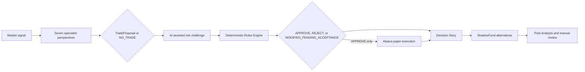
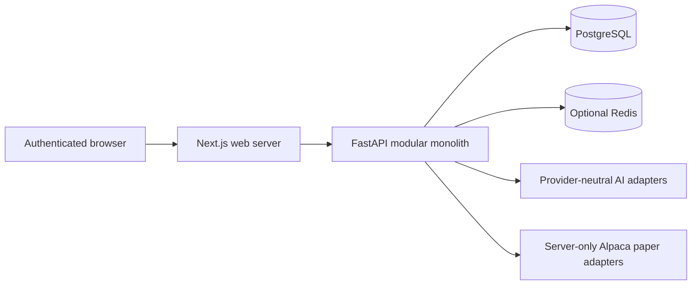

<div align="center">


# PRISM

**One signal. Multiple perspectives. Better decisions.**

AI-powered market intelligence with deterministic risk governance and Alpaca paper execution.

[](https://github.com/MaChewwwww/Alpaca_AI_Hackaton/actions/workflows/ci.yml)
[](docs/SECURITY.md)
[](docs/BUSINESS_RULES.md)
[](docs/DESIGN.md)

[Project concept](docs/conceptual/PROJECT_CONCEPT.md) · [Architecture](docs/ARCHITECTURE.md) · [Business rules](docs/BUSINESS_RULES.md) · [Run locally](#run-prism)

</div>

> [!IMPORTANT]
> PRISM is paper-trading only. AI can research, challenge, and propose; deterministic code alone authorizes an order. Live trading is prohibited, execution is disabled by default, and uncertainty always fails closed.

## The idea

A market headline is not a trade thesis. Before acting, a decision-maker still needs to ask whether the event matters, whether the market has already priced it in, whether the economics justify the risk, and whether the position fits the portfolio.

PRISM connects that entire reasoning chain. Seven AI specialists examine the same opportunity from different angles, a risk specialist attacks the resulting proposal, and a deterministic Rules Engine decides what is actually permitted. The outcome becomes an auditable **Decision Story**: the evidence, debate, proposal, rule checks, paper action, alternatives, and lesson in one place.

The result is not a black-box trading bot. It is a governed decision system that makes action, restraint, and `NO_TRADE` equally explainable.

## From signal to decision



Every stage uses structured, versioned records. Stale evidence, invalid model output, changed order details, missing authorization, or uncertain provider state stops the workflow; none of them creates permission to trade.

## Seven perspectives, one accountable outcome

| Specialist | The question it answers |
| --- | --- |
| **News Agent** | What happened, when, from which source, and with what uncertainty? |
| **Quantitative Agent** | What do price, volume, volatility, liquidity, options data, and history show? |
| **Industry Agent** | How does the event compare with peers, competitors, and the wider sector? |
| **Fundamental Agent** | What does it mean for earnings, valuation, balance-sheet quality, and outlook? |
| **Macroeconomic Agent** | How do rates, policy, indexes, volatility, and the market regime affect it? |
| **Market Reaction/Mispricing Agent** | Is the reaction justified, excessive, insufficient, or simply unclear? |
| **Trading Decision Agent** | Is there a supported paper options proposal, or should PRISM choose `NO_TRADE`? |

Risk Management may critique or recommend a safer change, but it cannot approve. `MODIFIED_PENDING_ACCEPTANCE` is never treated as authorization: an accepted change becomes a new proposal and goes through the Rules Engine again.

## What judges can explore

| Experience | What it reveals |
| --- | --- |
| **Overview** | Decision activity, portfolio context, outcomes, and recommendations at a glance |
| **Decision Stories** | Catalyst -> perspectives -> proposal -> risk -> rule outcome -> lesson |
| **Portfolio & Alternatives** | The chosen path beside ShadowFund counterfactuals on the same market path |
| **News & Market Tracker** | Evidence, price action, orders, fills, decisions, and `NO_TRADE` events in context |
| **Agents & Tools** | Each specialist's role, concise rationale, version, latency, and recorded tool use |
| **Rules** | The active ruleset, decision meanings, AI Profiles, and hackathon window |
| **Weekly Summary** | Post-Analysis findings and bounded profile suggestions for human review |

Demo and presentation records are explicitly labeled `illustrative_fixture`. They are not represented as an Alpaca account, paper order, fill, holding, profit-and-loss record, or model invocation. Genuine provider, Alpaca paper, ShadowFund, benchmark, and simulated data keep distinct provenance labels throughout the product.

## Safety is part of the product

- **Paper-only boundary:** server-side adapters reject live mode; the browser never calls Alpaca directly.
- **Deterministic authority:** AI provides research, proposals, critiques, and recommendations, never execution permission.
- **Exact authorization binding:** approval is tied to the proposal, ruleset, AI Profile, market snapshot, portfolio snapshot, allowed order payload, decision time, and expiry.
- **Last-moment protection:** execution rechecks paper mode, kill switch, freshness, permissions, buying power, contract activity, and payload integrity.
- **Fail-closed behavior:** missing, stale, contradictory, invalid, or uncertain inputs result in no order.
- **Server-side secrets:** Alpaca and LLM credentials never enter browser code or responses.
- **Safe reconciliation:** ambiguous submissions are reconciled by client order ID instead of being blindly retried.
- **Controlled learning:** Post-Analysis can suggest bounded AI Profile changes, but deterministic validation and manual review are required.

### Governed operating envelope

The versioned baseline is `prism-authorized-baseline@1.0.0`; Balanced is the default AI Profile.

| Control | Authorized baseline |
| --- | --- |
| Reference capital | `100,000.00 USD`, a sizing baseline rather than an account-balance claim |
| Target allocation | `2.00%` of equity in NORMAL conditions; `1.50%` maximum in VOLATILE conditions |
| Risk per trade | `1.00%` of current equity in NORMAL; `0.75%` in VOLATILE |
| Portfolio protection | At least `5.00%` cash; no more than `6` positions; modeled hard-stop risk no more than `3.00%` |
| Opportunity quality | Absolute floor `75`; Balanced threshold `84` |
| Trade economics | Net expected value at least `+0.15R`; realistic reward/risk at least `1.50:1` |
| Evidence and execution | Evidence no older than `30 seconds`; spread no more than `10.00%` of premium |
| Standard exit | `75.00%` take-profit; `50.00%` fixed stop-loss; default DTE exit at `7 days` |
| Holding period | Reusable baseline `14 days`; hackathon override `4 trading days` |

The supported options envelope is intentionally narrow: long calls, long puts, and two-leg 1:1 long call or put debit spreads. Naked shorts, credit spreads, equity legs, rolls, extended-hours orders, unsupported permissions, and unverified account capabilities are rejected. When IV Rank is above `50%`, policy requires a defined-risk debit spread and the tighter volatile caps.

### Fixed hackathon window

| Control | Authorized time |
| --- | --- |
| Trading starts | Monday, Aug 31, 2026 at 09:30 ET |
| New entries stop | Wednesday, Sep 2, 2026 at 16:00 ET |
| Scoring and force-flatten | End of day Thursday, Sep 3, 2026, using total account equity |
| Outer boundary | Friday, Sep 4, 2026 at 09:30 ET; not extra holding or scoring time |

## Architecture



The trust boundary is deliberate: the frontend receives presentation data, never brokerage or model credentials. Financial values cross API boundaries as decimal strings, timestamps are UTC, and generated OpenAPI types keep the backend and frontend aligned.

| Layer | Technology |
| --- | --- |
| Web | Next.js 16, React 19, TypeScript, Tailwind, Radix/shadcn primitives |
| API | FastAPI, Python 3.12, Pydantic |
| Data | PostgreSQL 17, SQLAlchemy 2, Alembic; optional Redis |
| Integrations | Server-side Alpaca and provider-neutral LLM adapters |
| Contracts | FastAPI OpenAPI with generated TypeScript transport types |
| Operations | Docker Compose, Nginx, GitHub Actions, protected environments |

## Run PRISM

Prerequisites: Node.js 24, Corepack/pnpm 11.24.0, Python 3.12 with `uv`, and optionally Docker Compose v2.

```bash
corepack enable
cp .env.example .env
pnpm setup
pnpm contracts
pnpm dev
```

Open the web app at `http://localhost:3000` and the API at `http://localhost:8000`. Replace the development authentication examples in `.env`; judge access is configured server-side. Keep these safeguards in place unless running an explicitly authorized paper workflow:

```text
EXECUTION_ENABLED=false
ALPACA_PAPER=true
ALPACA_LIVE_TRADE=false
```

For the containerized stack:

```bash
pnpm docker:up
```

## Essential commands

| Command | Purpose |
| --- | --- |
| `pnpm dev` | Run the web and API development servers |
| `pnpm contracts` | Regenerate OpenAPI and frontend transport types |
| `pnpm test` | Run frontend and backend tests |
| `pnpm verify` | Run the complete governance, quality, contract, test, and build gate |
| `pnpm docker:config` | Validate the production Compose configuration |

## Repository map

```text
frontend/                 Next.js product experience
backend/app/              FastAPI application and domain modules
backend/tests/            Backend behavior and contract tests
backend/app/rules/        Versioned machine-readable governance
docs/                     Product, architecture, rules, security, and operations
scripts/                  Repository checks and document synchronization
.agents/rules/            Canonical contributor and agent instructions
```

## Read the source of truth

Start with the [documentation index](docs/README.md), then follow the authority chain:

```text
repository invariants
  -> BA requirements and versioned parameter register
  -> AI architecture
  -> API contracts
  -> implementation and tests
  -> explanatory concept documents
```

Key references: [Project Concept](docs/conceptual/PROJECT_CONCEPT.md) · [Business Rules](docs/BUSINESS_RULES.md) · [AI Agents](docs/AI_AGENTS.md) · [AI Profiles](docs/AI_PROFILES.md) · [Architecture](docs/ARCHITECTURE.md) · [Data/API Contracts](docs/DATA_API_CONTRACTS.md) · [Security](docs/SECURITY.md) · [Design](docs/DESIGN.md) · [Governance Traceability](docs/GOVERNANCE_TRACEABILITY.md)

The numerical register lives in [`backend/app/rules/authorized_baseline.v1.json`](backend/app/rules/authorized_baseline.v1.json). Values that are not authorized there, including unresolved availability SLOs and backup RPO/RTO, are not guessed or presented as commitments.
