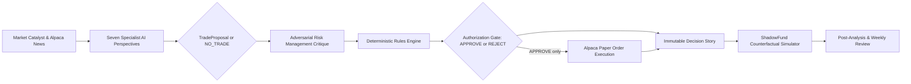
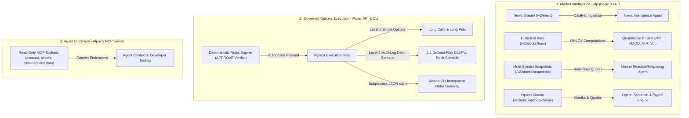
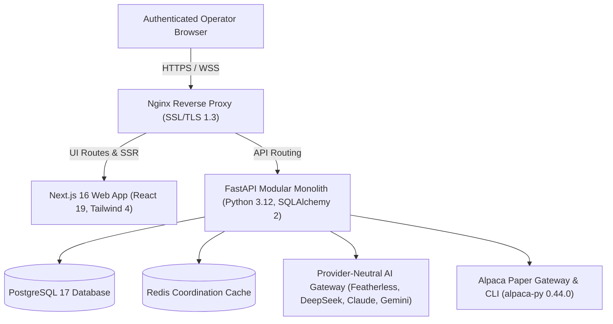

<div align="center">


# PRISM

**One signal. Multiple perspectives. Better decisions.**

### Autonomous Multi-Agent Market Intelligence with Deterministic Risk Governance & Alpaca Paper Execution

[](https://prism-ai.japanwest.cloudapp.azure.com)
[](https://lablab.ai/ai-hackathons/alpaca-ai-trading-agents-hackathon)
[](docs/SECURITY.md)
[](docs/BUSINESS_RULES.md)
[](docs/DESIGN.md)
[](https://github.com/MaChewwwww/PRISM/actions/workflows/ci.yml)

<p align="center">
  <a href="https://prism-ai.japanwest.cloudapp.azure.com"><strong>Explore Live Platform</strong></a> ·
  <a href="docs/conceptual/PROJECT_CONCEPT.md"><strong>Project Concept</strong></a> ·
  <a href="docs/ARCHITECTURE.md"><strong>Architecture</strong></a> ·
  <a href="docs/TECH_STACK.md"><strong>Tech Stack & Alpaca Tools</strong></a> ·
  <a href="docs/BUSINESS_RULES.md"><strong>Business Rules</strong></a> ·
  <a href="#quickstart"><strong>Quickstart</strong></a>
</p>

</div>

---

> [!IMPORTANT]
> **Governed Paper Trading:** PRISM operates exclusively in paper-trading mode against Alpaca's paper endpoints. AI specialists generate research, debate theses, and structure proposals; mathematical deterministic rules alone authorize execution. Live trading is prohibited, and all ambiguous conditions fail closed.

---

## What is PRISM?

A breaking headline or market spike is never a complete trade thesis. Before taking risk, an intelligent trading system must answer crucial questions:
- *Is the catalyst genuine or noise?*
- *Has the market already priced it in?*
- *Do quantitative momentum, volume, and volatility validate the move?*
- *How does the sector and macro regime impact the thesis?*
- *Are the options economics favorable after spreads and execution friction?*
- *Does the trade comply with hard portfolio risk, concentration, and drawdown limits?*

**PRISM** connects this entire analytical and operational chain into an autonomous, institutional-grade decision platform. **Seven specialized AI agents** analyze market catalysts from independent perspectives, an **adversarial Risk Management agent** stress-tests the trade, and a **deterministic Rules Engine** enforces hard mathematical guardrails before submitting paper orders to **Alpaca**.

Every trade, modification, rejection, or `NO_TRADE` decision is permanently recorded as an auditable **Decision Story**—linking raw evidence, multi-agent debate, risk critique, mathematical rule traces, paper execution, and counterfactual simulation in one unified interface.

---

## End-to-End Autonomous Decision Pipeline



Every stage produces typed, versioned records. Stale market data (>30s), invalid structured outputs, changed order parameters, missing authorization, or elevated spread costs immediately stop execution—ensuring total safety and auditability.

---

## Seven Specialist Perspectives, One Accountable Outcome

| Specialist Agent | Domain & Focus Question | Authoritative Role |
| --- | --- | --- |
| **News Agent** | *What happened, when, from which source, and with what credibility?* | Ingests news catalysts via Alpaca News API; performs SHA-256 deduplication; outputs structured sentiment, significance, and confidence. |
| **Quantitative Agent** | *What do price action, momentum, volatility, and volume trends show?* | 100% deterministic technical computation (RSI, MACD, Bollinger Bands, ATR, 20/50/200 SMAs, annualized volatility). |
| **Industry Agent** | *How does this event affect sector peers, competitors, and supply chains?* | Benchmarks sector dynamics, competitor sympathy moves, and industry-level catalysts. |
| **Fundamental Agent** | *What are the implications for earnings, valuation, balance sheet, and outlook?* | Evaluates financial health via live SEC EDGAR companyfacts (operating margin, debt-to-equity, free cash flow). |
| **Macroeconomic Agent** | *How do interest rates, monetary policy, market regimes, and VIX influence risk?* | Assesses macro regime, yields, index trends, and systemic volatility. |
| **Market Reaction/Mispricing Agent** | *Is the market reaction justified, overdone, underdone, or uncertain?* | Measures expected vs. observed price delta; calculates the quantitative **Opportunity Score** (0–100). |
| **Trading Decision Agent** | *Is there a viable options trade with positive net EV, or should we choose `NO_TRADE`?* | Formulates structured `TradeProposal` (structure, strikes, DTE, limit prices, and exit policy) or emits `NO_TRADE`. |

### Downstream Governance, Execution & Learning Stages

- **Adversarial Risk Management Agent:** Challenges trade proposals against portfolio concentration, drawdown levels, liquidity constraints, and contradictory evidence. Suggests safer parameters but cannot approve execution.
- **Deterministic Rules Engine (P0–P5):** Evaluates proposals against mathematical rules (`PASS`, `MODIFY`, `FAIL`). Aggregates results into strict `APPROVE`, `REJECT`, or `MODIFIED_PENDING_ACCEPTANCE`.
- **Alpaca Paper Execution Gate:** Re-validates paper mode, kill switch, freshness, and payload integrity before submitting orders via the Alpaca API and CLI.
- **Autonomous Worker (5-Minute Cadence):** Scans the 7 allowlisted mega-cap tickers (`NVDA`, `TSLA`, `AAPL`, `MSFT`, `AMD`, `GOOGL`, `AMZN`) every 300 seconds, acquiring PostgreSQL advisory locks and enforcing mandatory exit rules (75% TP, 50% SL, 7 DTE, 4-day max hold).
- **ShadowFund Counterfactual Simulator:** Continuously simulates alternative decisions (Cash / No Action, Half Size, Contrarian/Inverse, Specialist Alternative) on the identical market timeline without capital risk.
- **Post-Analysis Learning Engine:** Asynchronously reflects on closed trades and ShadowFund outcomes every Friday post-close and at hackathon scoring milestones to recommend bounded AI Profile adjustments (`target_position_size_pct`, `opportunity_score_threshold`, `take_profit_pct`, `stop_loss_pct`).

---

## Alpaca Ecosystem Integration

PRISM deeply leverages Alpaca's developer platform across research, market data, paper execution, and agent exploration:



| Alpaca Component | Endpoints & Scope | PRISM Architectural Role | Safety & Governance Envelope |
| --- | --- | --- | --- |
| **`alpaca-py` Market Data API** | `/v2/news`<br>`/v2/stocks/bars`<br>`/v2/stocks/snapshots`<br>`/v1beta1/options/chains` | Ingests real-time catalysts for **News Agent**; feeds OHLCV bars into **Quantitative Engine**; provides live option chains, bid/ask spreads, and Greeks to **Trading Decision Agent**. | Read-only market intelligence; freshness strictly checked (<= 30s) before any trade proposal. |
| **Alpaca Paper Trading API** | `/v2/orders`<br>`/v2/positions`<br>`/v2/account` | Executes approved option contracts (Level 2 Long Calls/Puts and Level 3 Multi-Leg 1:1 Debit Spreads via `order_class=mleg`). | Restricted to paper endpoints (`paper-api.alpaca.markets`); limit pricing within <= 10% spread; day TIF. |
| **Alpaca CLI (v0.0.13)** | Subprocess order gateway | Secure server-side order submission receiving typed JSON over standard input; handles client-order-id idempotency and disconnect reconciliation. | Prevents shell injection; keeps credentials strictly isolated in backend memory (never exposed to browser or LLMs). |
| **Alpaca MCP Server** | `account`, `assets`, `stock-data`, `options-data`, `news` | Provides structured market and asset discovery tools for developer workflows and research agents. | Read-only tools only; mutating trading tools are excluded to prevent LLMs from bypassing deterministic rules. |

---

## Institutional Risk Governance & Safety

In PRISM, safety is an architectural core, not an afterthought. AI models produce research and proposals, but **deterministic mathematical code controls authorization**.

### Fail-Safe Execution Architecture

- **Paper-Only Invariant:** Execution is restricted to Alpaca's paper trading environment (`https://paper-api.alpaca.markets/v2`). Any live-trading configuration causes an immediate startup halt.
- **Fail-Closed Execution Gate:** Orders require an active ruleset, complete paper credentials, fresh market data (<= 30s), and a valid `APPROVE` verdict. If data is stale, unparseable, or contradictory, execution safely halts.
- **Autonomous Schedule Bounding:** Production autonomous trading operates on a 5-minute (300-second) cadence bounded by half-open UTC scheduling windows (`AUTONOMOUS_TRADING_START_AT` to `AUTONOMOUS_TRADING_END_AT`) strictly contained within authorized hackathon market hours. Staging rejects autonomous trading and uses historical simulation only.
- **Global Kill Switch:** Instantly suspends all new paper order submissions while preserving real-time portfolio monitoring, telemetry, and audit logging.
- **Zero Client Credentials:** Alpaca keys and LLM tokens remain strictly on the backend server—never exposed to the browser.

### Governed Operating Envelope (`prism-authorized-baseline@1.0.0`)

| Parameter | Authorized Baseline | Operational Description |
| --- | ---: | --- |
| **Reference Capital** | `100,000.00 USD` | Standard sizing reference baseline |
| **Target Allocation** | `2.00%` (Balanced) | Normal target position sizing (`1.50%` Conservative, `2.50%` Aggressive; max `1.50%` in Volatile regime) |
| **Max Risk per Trade** | `0.75%` – `1.00%` | Max equity risk per trade (capped at `0.75%` in Volatile regime) |
| **Cash Reserve Floor** | `10.00%` | Minimum unallocated cash reserve required before new entries |
| **Position Limit** | `6 positions` | Maximum simultaneous active positions |
| **Concentration Limits** | `25.00%` / `50.00%` / `40.00%` | Maximum Ticker / Sector / Correlated Cluster exposure |
| **Data Freshness** | `<= 30 seconds` | Max allowable age for market quotes and catalyst evidence |
| **Bid/Ask Spread Cap** | `<= 10.00%` | Maximum allowable spread width relative to option premium |
| **Opportunity Score Floor** | `75` min / `84` Balanced | Minimum research score required for proposal generation (`90` Conservative, `80` Aggressive) |
| **Trade Economics** | Net EV `>= +0.15R`, R:R `>= 1.50:1` | Mandatory mathematical edge and reward-to-risk ratio |
| **Exit Strategy** | `75.00%` TP / `50.00%` SL | Fixed take-profit and stop-loss targets (take-profit tunable up to 100%) |
| **DTE Exit Threshold** | `7 days` | Default expiration exit to mitigate extreme gamma risk |
| **Baseline Maximum Hold** | `14 days` | Standard multi-day position holding cap |
| **Hackathon Hold Override** | `4 trading days` | Tightened holding cap tailored to the hackathon window |

### Fixed Hackathon Operating Window

| Milestone | Authorized Schedule (ET) | Operational Rule |
| --- | --- | --- |
| **Trading Opens** | Monday, Aug 31, 2026 at 09:30 ET | First eligible entry time |
| **New Entries Stop** | Wednesday, Sep 2, 2026 at 16:00 ET | Entry cutoff; existing positions managed/exited only |
| **Official Scoring & Force-Flatten** | Thursday, Sep 3, 2026 (Market Close) | All positions force-flattened; total account equity scored |
| **Outer Window Boundary** | Friday, Sep 4, 2026 at 09:30 ET | Outer boundary edge; not extra trading or holding time |

---

## ShadowFund: Counterfactual Simulation

One of the greatest challenges in quantitative trading is counterfactual validation: *"What would have happened if we took a different path?"*

**ShadowFund** is PRISM's simulation engine. For every evaluated catalyst, ShadowFund tracks alternative strategies along the exact same subsequent market timeline without placing orders:

- **Cash / No Action:** Benchmarks opportunity cost against holding cash.
- **Half Size:** Measures volatility and drawdown reduction at 0.5x sizing.
- **Contrarian / Inverse:** Evaluates the opposite market thesis.
- **Specialist Alternative:** Tracks secondary options structures generated during agent debate.

ShadowFund calculates counterfactual P&L, Maximum Adverse Excursion (MAE), Maximum Favorable Excursion (MFE), and Sharpe tracking—feeding actionable data into the Weekly Summary and `PostAnalysisAgent` for continuous learning.

---

## What Judges Can Explore in the Live Platform

Visit the live production deployment at **[https://prism-ai.japanwest.cloudapp.azure.com](https://prism-ai.japanwest.cloudapp.azure.com)** to experience PRISM's full suite of interactive workspaces:

| Workspace Surface | Interactive Features & Capabilities |
| --- | --- |
| 🌟 **Overview Dashboard** | Real-time portfolio equity, active decision stream, win rates, and AI recommendations at a glance. |
| 📖 **Decision Stories** | Step-by-step interactive inspection of every trade: Catalyst -> 7 Perspectives -> Proposal -> Risk Critique -> Deterministic Rule Trace -> Paper Execution -> Lessons Learned. |
| 📈 **Market Tracker** | Interactive financial charts synchronized with filterable activity overlays (Orders, Fills, Proposals, Decisions, `NO_TRADE`, and Shadow events). |
| 👥 **Agents & Observability** | Real-time observability into all 7 AI specialists: rationale, prompt versions, latency, token consumption, and tool invocations. |
| 💼 **Portfolio & Positions** | Active Alpaca paper holdings, allocation breakdowns, Greeks, and P&L performance. |
| 🧪 **ShadowFund & Alternatives** | Interactive counterfactual comparison trees showing chosen trades vs. alternative paths on identical market data. |
| 📰 **News & Market Catalysts** | Live catalyst stream with sentiment classification, credibility scoring, and direct links to resulting decision stories. |
| 🛡️ **Rules & Governance** | Transparent inspection of the active baseline ruleset, AI Profile configurations (Conservative, Balanced, Aggressive), and hackathon controls. |
| 📊 **Weekly Summary** | Post-Analysis performance attribution and bounded AI Profile parameter suggestions for human review. |

---

## Technology Stack

PRISM is built with a modern, high-performance, and type-safe architecture:



- **Frontend:** Next.js 16 App Router, React 19, TypeScript, Tailwind CSS 4, Radix UI primitives, Lucide Icons, WCAG 2.2 AA Dark Cyber-Crystalline theme.
- **Backend:** FastAPI, Python 3.12, Pydantic 2, SQLAlchemy 2 (asyncpg), Alembic migrations, PostgreSQL 17.
- **Alpaca Platform:** `alpaca-py` 0.44.0 (Market Data & Trading APIs), Alpaca CLI v0.0.13, Alpaca MCP server.
- **AI Gateway:** Provider-neutral adapter supporting Featherless AI, DeepSeek, Anthropic Claude 3.5, Google Gemini, OpenAI GPT-4o, and Ollama.
- **Deployment:** Docker Compose, Nginx, Azure VM, GitHub Actions CI/CD with automated quality, linting, contract synchronization, and test gates.

---

## Quickstart

### Prerequisites

- **Node.js**: v24.x
- **pnpm**: v11.24.0 (`corepack enable`)
- **Python**: v3.12+ with `uv`
- **Docker & Docker Compose** (optional for containerized run)

### 1. Local Development Setup

```bash
# Clone repository
git clone https://github.com/MaChewwwww/PRISM.git
cd PRISM

# Enable package manager and configure environment
corepack enable
cp .env.example .env

# Install frontend and backend dependencies
pnpm setup

# Generate typed OpenAPI contracts
pnpm contracts

# Launch development servers (Frontend: http://localhost:3000 | API: http://localhost:8000)
pnpm dev
```

### 2. Running via Docker Compose

```bash
# Start all services (PostgreSQL, FastAPI Backend, Next.js Frontend, Nginx)
pnpm docker:up

# View running container status
pnpm docker:status

# Stop containers
pnpm docker:down
```

### Essential Commands

| Command | Description |
| --- | --- |
| `pnpm dev` | Run Next.js frontend and FastAPI backend concurrently |
| `pnpm test` | Run complete unit and component test suites (25 Vitest & 146 Pytest) |
| `pnpm contracts` | Regenerate FastAPI OpenAPI schema and TypeScript transport types |
| `pnpm verify` | Run full governance, linting, contract, and test verification gate |
| `pnpm docker:up` | Build and launch containerized stack via Docker Compose |

---

## Documentation & Architecture Deep Dives

For detailed engineering specifications, explore the authoritative documentation:

- 📖 **[Project Concept](docs/conceptual/PROJECT_CONCEPT.md)** — Comprehensive product vision and market thesis.
- 🏛️ **[System Architecture](docs/ARCHITECTURE.md)** — Detailed component boundaries and dependency flows.
- ⚡ **[Tech Stack & Alpaca Tools](docs/TECH_STACK.md)** — Technology matrix and Alpaca integration breakdown.
- 🛡️ **[Business Rules](docs/BUSINESS_RULES.md)** — Complete mathematical specification of active baseline parameters.
- 👥 **[AI Agents Topology](docs/AI_AGENTS.md)** — Specialist responsibilities, prompt structure, and structured outputs.
- ⚙️ **[AI Profiles](docs/AI_PROFILES.md)** — Configurable risk profiles (Conservative, Balanced, Aggressive).
- 🧪 **[ShadowFund Specification](docs/SHADOWFUND.md)** — Counterfactual simulation mechanics and evaluation horizons.
- 🦙 **[Alpaca Integration Guide](docs/ALPACA_INTEGRATION.md)** — Official SDK, CLI, and MCP gateway specifications.
- 🔒 **[Security & Safety Controls](docs/SECURITY.md)** — Credential handling, fail-safe gates, and paper-trading safeguards.
- 🎨 **[Design System](docs/DESIGN.md)** — Dark Cyber-Crystalline aesthetic, color tokens, and accessibility standards.
- 📋 **[Governance Traceability](docs/GOVERNANCE_TRACEABILITY.md)** — Requirements mapping and parameter register.

---

<div align="center">

**Built with precision for the Alpaca AI Trading Agents Hackathon.**

<a href="https://prism-ai.japanwest.cloudapp.azure.com"><strong>🚀 Access the Live PRISM Platform</strong></a>

</div>
