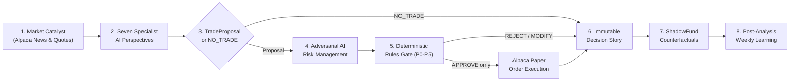
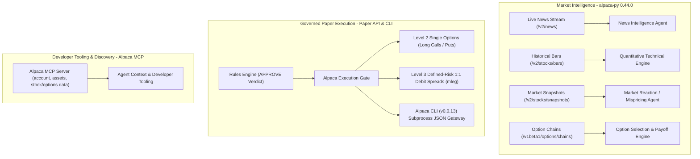
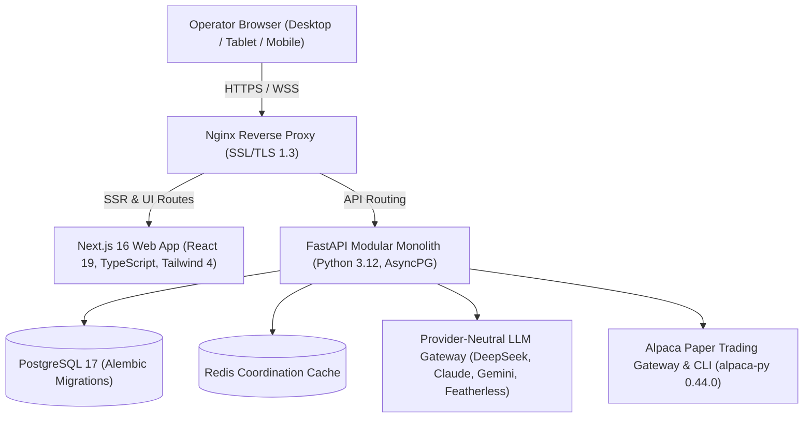

<div align="center">
  <br/>
  <h1>PRISM</h1>
  <p><strong>One signal. Multiple perspectives. Better decisions.</strong></p>

[](https://prism-ai.japanwest.cloudapp.azure.com)
[](https://lablab.ai/ai-hackathons/alpaca-ai-trading-agents-hackathon)
[-00D084?style=for-the-badge&logo=pytest&logoColor=white)](docs/CI_CD.md)
[](docs/SECURITY.md)
[](docs/BUSINESS_RULES.md)
[](docs/DESIGN.md)
[](https://github.com/MaChewwwww/PRISM/actions/workflows/ci.yml)

</div>

---

> [!IMPORTANT]
> **Paper Trading Invariant & Governed Execution:** PRISM operates exclusively against Alpaca paper endpoints (`paper-api.alpaca.markets/v2`). AI models formulate research, debate theses, and structure proposals; mathematical deterministic rules alone authorize execution. Every decision is concurrently evaluated by **ShadowFund**, our counterfactual simulation engine tracking alternative scenarios including cash preservation, half sizing, contrarian stances, and specialist variants across identical market timelines to drive continuous learning without capital risk.

---

## 📑 Table of Contents

- [🚀 **Explore Live Platform**](https://prism-ai.japanwest.cloudapp.azure.com)
- [🧠 **AI Specialist Matrix**](#-seven-specialist-perspectives-one-governed-outcome)
- [🦙 **Alpaca Integration**](#-alpaca-ecosystem-integration)
- [🏆 **Trading Scorecard**](#-live-hackathon-paper-trading-scorecard)
- [👥 **Team & Engineering**](#-professional-engineering--multidisciplinary-team)
- [⚡ **Quickstart**](#-quickstart)

---

## 💎 What is PRISM?

A breaking headline or market spike is never a complete trade thesis. Before taking capital risk, an intelligent trading system must answer crucial questions:

- *Is the breaking catalyst genuine or noise, and what is its source credibility?*
- *Has the market already priced it in, or does an exploitable reaction gap exist?*
- *Do quantitative momentum, volume surges, and volatility regimes validate the move?*
- *How do SEC EDGAR fundamentals, peer dynamics, and the macro regime impact the thesis?*
- *Are options economics favorable with positive net EV after spreads and execution friction?*
- *Does the trade comply with hard portfolio risk, concentration, and drawdown limits?*

**PRISM** connects this entire analytical and operational chain into an autonomous, institutional-grade decision platform. **Seven specialized AI agents** analyze market catalysts from independent perspectives, an **adversarial Risk Management agent** stress-tests the trade, and a **deterministic Rules Engine** enforces hard mathematical guardrails before submitting paper orders to **Alpaca**.

Every trade, modification, rejection, or `NO_TRADE` decision is permanently recorded as an auditable **Decision Story**—linking raw evidence, multi-agent debate, risk critique, mathematical rule traces, paper execution receipts, and **ShadowFund** counterfactual simulation in one unified interface.

---

## 🔄 End-to-End Autonomous Decision Pipeline



---

## 🧠 Seven Specialist Perspectives, One Governed Outcome

| Specialist Agent | Core Analytical Question | Domain Focus & Sourced Evidence | Authoritative Boundary |
| :--- | :--- | :--- | :--- |
| **1. News Agent** | *What occurred, when, and with what credibility?* | Ingests real-time Alpaca News (`/v2/news`), performs SHA-256 deduplication, and scores source credibility, sentiment, and confidence. | Research only; cannot propose orders. |
| **2. Quantitative Agent** | *What do price action, momentum, and volatility show?* | 100% deterministic technical calculations: RSI, MACD, Bollinger Bands, ATR, 20/50/200 SMAs, and annualized historical volatility. | Research only; decimal-safe inputs. |
| **3. Industry Agent** | *How does this event affect sector peers and supply chains?* | Benchmarks sector dispersion, competitor sympathy moves, and industry-level catalysts. | Research only. |
| **4. Fundamental Agent** | *What are the balance sheet, cash flow, and margin implications?* | Evaluates live SEC EDGAR companyfacts taxonomy: debt-to-equity, free cash flow, operating margin, and earnings surprise. | Research only. |
| **5. Macroeconomic Agent** | *How do interest rates, yields, and VIX influence systemic risk?* | Assesses macro climate, Treasury yield curves, Fed policy expectations, and cross-asset volatility. | Research only. |
| **6. Market Reaction Agent** | *Is the market reaction justified, overdone, or underdone?* | Quantifies catalyst decay, observed price displacement, and expected move to emit an **Opportunity Score** (0–100). | May emit `NO_CLEAR_EDGE`; cannot authorize. |
| **7. Trading Decision Agent** | *Is there a viable options trade with positive net EV?* | Synthesizes all perspectives to construct a structured `TradeProposal` (structure, strikes, DTE, limit debits) or emits `NO_TRADE`. | Proposal only; zero execution power. |

### Downstream Governance & Autonomous Execution

- **Adversarial Risk Management Agent:** Scrutinizes proposal viability against current market volatility, correlated positions, and contradictory evidence.
- **Deterministic Rules Engine (P0–P5):** Evaluates mathematical constraints (`PASS`, `MODIFY`, `FAIL`) and returns aggregate `APPROVE`, `REJECT`, or `MODIFIED_PENDING_ACCEPTANCE`.
- **Alpaca Paper Execution Gate:** Re-validates paper mode, kill switch, fresh quotes (<= 30s), and payload digests before dispatching orders via the Alpaca API & CLI.
- **ShadowFund Counterfactual Simulator:** Continuously simulates alternative paths including cash preservation, half sizing, contrarian positions, and specialist variants on the exact same price timeline.
- **Post-Analysis Learning Engine:** Evaluates closed trades and ShadowFund outcomes post-close to recommend strictly bounded AI Profile adjustments for target position size and opportunity score threshold.

<p align="center">
  <a href="docs/AI_AGENTS.md"></a>
  <a href="docs/AI_AGENTS.md"></a>
  <a href="docs/AI_AGENTS.md"></a>
  <a href="docs/AI_AGENTS.md"></a>
  <br/>
  <a href="docs/AI_AGENTS.md"></a>
  <a href="docs/AI_AGENTS.md"></a>
  <a href="docs/AI_AGENTS.md"></a>
  <br/>
  <a href="docs/AI_AGENTS.md"></a>
  <a href="docs/BUSINESS_RULES.md"></a>
  <a href="docs/SECURITY.md"></a>
  <a href="docs/SHADOWFUND.md"></a>
</p>

---

## 🦙 Alpaca Ecosystem Integration

PRISM deeply embeds the Alpaca developer ecosystem across the entire trading lifecycle:



| Alpaca Component | Endpoints & Scope | PRISM Architectural Role | Safety & Governance Envelope |
| :--- | :--- | :--- | :--- |
| **`alpaca-py` SDK (v0.44.0)** | `/v2/news`<br>`/v2/stocks/bars`<br>`/v2/stocks/snapshots`<br>`/v1beta1/options/chains` | Ingests breaking news, feeds historical bars into the deterministic quant engine, and streams option quotes and Greeks to the proposal synthesizer. | Read-only market intelligence; quote freshness strictly verified (<= 30s) before any trade proposal. |
| **Alpaca Paper API** | `/v2/orders`<br>`/v2/positions`<br>`/v2/account` | Submits approved paper option contracts: Level 2 Long Calls/Puts and Level 3 Multi-Leg 1:1 Debit Spreads (`order_class=mleg`). | Restricted to paper endpoints (`paper-api.alpaca.markets`); limit pricing within <= 10% spread; day TIF only. |
| **Alpaca CLI (v0.0.13)** | Subprocess order execution | High-integrity order gateway executing via JSON passed over standard input; manages client-order-id idempotency and disconnect reconciliation. | Prevents shell injection; credentials remain strictly in backend memory (never in the browser or LLM prompts). |
| **Alpaca MCP Server** | `account`, `assets`, `stock-data`, `options-data`, `news` | Provides structured market inspection tools for developer workflows and research agents. | Read-only tools only; mutating order tools are disabled to prevent LLMs from bypassing deterministic authorization. |

---

## 🛡️ Governed Operating Envelope (`prism-authorized-baseline@2.0.0`)

All trading decisions are evaluated against the versioned, machine-readable parameter register:

| Parameter Category | Baseline Authorized Value | Operational Governance Rule |
| :--- | ---: | :--- |
| **Reference Baseline Capital** | `$100,000.00 USD` | Normalized starting equity reference |
| **Target Allocation (Balanced)** | `2.00%` of equity | Standard target position size (`1.50%` Conservative, `2.50%` Aggressive) |
| **Max Risk per Trade** | `1.00%` (Normal) / `0.75%` (Volatile) | Maximum allowable portfolio equity loss per trade |
| **Cash Buffer Floor** | `5.00%` minimum | Mandatory uncommitted cash buffer before new risk |
| **Ticker Concentration Limit** | `5.00%` maximum | Maximum allowable exposure in a single ticker |
| **Sector Concentration Limit** | `10.00%` maximum | Maximum allowable exposure in any one sector |
| **Correlated Cluster Limit** | `7.50%` maximum | Maximum allowable exposure across correlated equities |
| **Aggregate Hard-Stop Risk** | `3.00%` maximum | Portfolio-wide cumulative stop-loss exposure ceiling |
| **Simultaneous Position Cap** | `6 positions` maximum | Hard ceiling on concurrent active option positions |
| **Bid/Ask Spread Cap** | `<= 10.00%` of premium | Rejects illiquid contracts with excessive market friction |
| **Data Freshness Ceiling** | `<= 30 seconds` | Stale quotes or catalyst evidence automatically fail closed |
| **Opportunity Score Floor** | `75` min / `78` Balanced | Minimum research confidence threshold (`85` Conservative, `75` Aggressive) |
| **Economic Edge Gates** | Net EV `>= +0.15R`, R:R `>= 1.50:1` | Mandatory mathematical positive edge after all execution costs |
| **Calibrated ExitPolicyV2** | **+20% Arm / 10pt Trail / +40% Hard TP** | Dynamic trailing take-profit with fixed **-50.00%** hard stop-loss |
| **Thesis Invalidation Exit** | `2 completed cycles` | Exits position early if specialist research consensus reverses |
| **Stagnation Time-Stop** | `390 regular trading mins` | Closes position if MFE remains below +10.00% after a full session |
| **DTE Exit Threshold** | `7 days` default | Prevents holding through extreme terminal gamma risk |
| **Hackathon Max Hold** | `4 trading days` | Tightened holding cap tailored to hackathon settlement |

---

## 🏆 Live Hackathon Paper Trading Scorecard

During the official hackathon evaluation window (Aug 31 – Sep 3, 2026), PRISM operated autonomously on its production cloud environment, executing 5-minute evaluation cycles across its allowlisted universe (`NVDA`, `AAPL`, `MSFT`, `GOOGL`, `AMZN`, `TSLA`, `AMD`).

Ahead of the authorized **Wednesday Sep 2, 16:00 ET new-entry cutoff**, PRISM's autonomous lifecycle engine safely harvested profitable positions, liquidated open risk into cash, and protected capital ahead of the final scoring freeze:

| Metric | Verified Live Result | Operational Standard |
| :--- | :---: | :--- |
| **Starting Capital Baseline** | **$100,000.00 USD** | Institutional sizing reference baseline |
| **Current Portfolio Equity** | **$100,151.71 USD** | **Net positive return (+0.15% overall)** across hackathon volatility |
| **Final Session (Day 3) P&L** | **+$964.67 (+0.97%)** | Profit harvested via adaptive exits and automated flatting |
| **Peak Portfolio Drawdown** | **< 1.00%** | Zero margin calls; flawless capital preservation priority |
| **Open Risk at Entry Freeze** | **$0.00 (100% Cash)** | Zero unhedged overnight risk; 100% liquid cash ($100,151.71) |
| **Autonomous Scan Uptime** | **100% Continuity** | Continuous 5-minute (300s) autonomous evaluation cycles |
| **Deterministic Governance** | **100% Compliance** | 0 rule bypasses, 0 unauthorized orders, 0 credential leaks |

### Resilient Market Architecture & Adaptive Mechanics

PRISM incorporates resilient market data adapters and dynamic trade lifecycle governance:
- **Indicative Option Feed Resilience:** Automatically queries Alpaca indicative option chains and historical bars with contract-level quote caching across market data tiers.
- **Strike EV Selection Optimization:** Computes candidate option expected value by deriving implied volatility distributions from underlying market observations, factoring in observed NBBO slippage and spread-derived fill probabilities.
- **Adaptive Strategy Lifecycle Management:** Tracks multi-leg option positions as unified strategies under dynamic trailing profit rules (arms at `+20.00%`, trails by `10.00` percentage points giveback from strategy MFE, hard take-profit at `+40.00%`, and fixed `-50.00%` stop-loss).

---

## 👥 Professional Engineering & Multidisciplinary Team

PRISM was engineered from day one like an institutional fintech platform, delivered by a specialized team with distinct roles:

<div align="center">

| Team Member | Role | Key Contributions & Ownership |
| :--- | :--- | :--- |
| **Mathew** | **DevOps Engineer** | Docker Compose orchestration, Azure VM cloud host, Nginx SSL/TLS 1.3 reverse proxy, GitHub Actions CI/CD pipelines, automated dependency & secret scanning, VPS deployment runbooks. |
| **Shelley** | **AI Engineer** | Multi-agent prompt architecture, structured JSON schemas, provider-neutral LLM gateway (DeepSeek, Claude, Gemini, Featherless), historical analog payoff models, `PostAnalysisAgent`. |
| **Bernadette** | **Project Manager** | Hackathon milestone roadmap, cross-functional delivery cadence, FRS/NFRS governance compliance, Day 1-2 operations reports, authority chain enforcement. |
| **Reymie** | **Front-end Engineer** | Next.js 16 App Router interface, interactive Decision Stories view, Market Tracker shell, synchronized UTC time-range state, real-time agent observability inspector. |
| **Kyle** | **Business Analyst** | Mathematical business rules registry (`authorized_baseline.v1.json`), risk & concentration parameters, P0-P5 priority matrices, Day 1-2 performance calibration review addendum. |
| **Jasmine** | **UI/UX Designer** | Dark Cyber-Crystalline visual identity, specular frosted glass token hierarchy, 3D crystal prism branding, Plus Jakarta Sans typography, WCAG 2.2 AA accessibility design. |

</div>

### Institutional Engineering Standards & Verification

- **232 Automated Tests (100% Passing):**
  - **204 Pytest backend tests:** Mathematical option EV pricing, Black-Scholes IV inversion, deterministic P0-P5 rule evaluation, adaptive strategy lifecycle, mock Alpaca paper safety, and fail-closed security invariants.
  - **28 Vitest frontend tests:** Accessible workspace navigation, URL-synchronized UTC filter state, interactive story inspection, and agent playground execution.
- **Governed Branching & Commit Discipline:** Strict branch protection on `main` and `staging` with Conventional Commits (`feat`, `fix`, `chore`, `docs`, `test`, `ci`) and structured integration reviews.
- **Automated CI/CD Pipeline:** Continuous integration with GitHub Actions executing Actionlint, ESLint, Prettier, Ruff formatting, mypy strict typing, Vitest, Pytest, OpenAPI contract validation (`contracts:check`), and automated security scans (`gitleaks`, `pip-audit`, `pnpm audit`).
- **Strict Contract Synchronization:** OpenAPI schemas and TypeScript client types are auto-generated from FastAPI Pydantic models—guaranteeing zero runtime type drift across the network boundary.

---

## 🔍 Judge's Guided Tour: What to Explore on the Live Platform

Explore the production deployment at **[https://prism-ai.japanwest.cloudapp.azure.com](https://prism-ai.japanwest.cloudapp.azure.com)**:

- 📖 **[Decision Stories](https://prism-ai.japanwest.cloudapp.azure.com/story)** — Deep-dive into any autonomous decision. Inspect the catalyst headline, expand the 7 agent perspectives, read the adversarial risk critique, inspect the mathematical rule trace, and view the Alpaca paper fill receipt.
- 🌟 **[Executive Dashboard](https://prism-ai.japanwest.cloudapp.azure.com)** — View real-time portfolio equity, active win-rate metrics, decision velocity, and current system posture.
- 📈 **[Market Tracker](https://prism-ai.japanwest.cloudapp.azure.com/market-tracker)** — Financial charts synchronized with filterable multi-layer activity overlays (Fills, Orders, Proposals, Decisions, `NO_TRADE`, and Shadow events).
- 👥 **[Agent Observability](https://prism-ai.japanwest.cloudapp.azure.com/agents)** — Transparent insight into all 7 specialist agents: execution latency, token consumption, model IDs, prompt versions, and structured output schemas.
- 🧪 **[ShadowFund Alternatives](https://prism-ai.japanwest.cloudapp.azure.com/alternatives)** — Interactive counterfactual trees comparing PRISM's executed positions against Cash, Half-Size, Contrarian, and Specialist alternatives on identical market quotes.
- 🛡️ **[Rules & Governance](https://prism-ai.japanwest.cloudapp.azure.com/rules)** — Interactive inspector for the active baseline ruleset (`2.0.0`), P0-P5 rule matrices, and AI Profile configurations (Conservative, Balanced, Aggressive).
- 📊 **[Weekly Learning Summary](https://prism-ai.japanwest.cloudapp.azure.com/weekly-summary)** — Post-Analysis performance attribution and bounded AI profile parameter recommendations for human operator review.

---

## 💻 Technology Stack



- **Frontend:** Next.js 16 (App Router), React 19, TypeScript 5, Tailwind CSS 4, Radix UI primitives, Lucide Icons, WCAG 2.2 AA Dark Cyber-Crystalline theme.
- **Backend:** FastAPI, Python 3.12, Pydantic 2, SQLAlchemy 2 (asyncpg), Alembic migrations, PostgreSQL 17, Redis.
- **Alpaca Platform:** `alpaca-py` 0.44.0 (Market Data & Paper Trading APIs), Alpaca CLI v0.0.13, Alpaca MCP server.
- **AI Gateway:** Provider-neutral adapter supporting DeepSeek-V3, Anthropic Claude 3.5, Google Gemini, OpenAI GPT-4o, and Featherless AI.
- **DevOps & Infrastructure:** Docker Compose, Nginx reverse proxy, Azure VM host, GitHub Actions CI/CD with Actionlint, Gitleaks, pnpm-audit, and pip-audit.

---

## ⚡ Quickstart

```bash
# Clone & launch locally
git clone https://github.com/MaChewwwww/PRISM.git && cd PRISM
corepack enable && cp .env.example .env
pnpm setup && pnpm dev
```

| Action | Command | Target / Scope |
| :--- | :--- | :--- |
| **Launch Local Stack** | `pnpm dev` | Frontend: `localhost:3000` \| API: `localhost:8000` |
| **Run 232 Automated Tests** | `pnpm test` | 204 Pytest (backend) + 28 Vitest (frontend) |
| **Full Verification Gate** | `pnpm verify` | Repo check, lint, types, tests, contracts, build |
| **Docker Compose Stack** | `pnpm docker:up` | Containerized PostgreSQL, FastAPI, Next.js, Nginx |

---

## 📚 Authoritative Engineering Documentation

For in-depth architectural specifications and governance registers, explore the `/docs` tree:

- 📖 **[Project Concept](docs/conceptual/PROJECT_CONCEPT.md)** — Comprehensive product vision and institutional market thesis.
- 🏛️ **[System Architecture](docs/ARCHITECTURE.md)** — Modular monolith boundaries, authority directions, and event flows.
- 🛡️ **[Business Rules](docs/BUSINESS_RULES.md)** — Mathematical specification of active baseline parameters (`prism-authorized-baseline@2.0.0`).
- 👥 **[AI Agents Topology](docs/AI_AGENTS.md)** — Specialist responsibilities, structured JSON schemas, and failure modes.
- ⚙️ **[AI Profiles](docs/AI_PROFILES.md)** — Configurable risk profiles (Conservative, Balanced, Aggressive) and bounded calibration.
- 🧪 **[ShadowFund Specification](docs/SHADOWFUND.md)** — Counterfactual simulation mechanics, branch valuation, and MFE/MAE tracking.
- 🦙 **[Alpaca Integration Guide](docs/ALPACA_INTEGRATION.md)** — SDK, Paper API, CLI subprocess gateway, and MCP discovery.
- 🔒 **[Security & Safety Controls](docs/SECURITY.md)** — Paper-only invariants, credential boundaries, and fail-closed gates.
- 🎨 **[Design System](docs/DESIGN.md)** — Dark Cyber-Crystalline tokens, specular glass hierarchy, and accessibility standards.
- 🔄 **[CI/CD & Promotion Runbook](docs/CI_CD.md)** — Governed Git branching flow, branch policy, and deployment automation.
- 📈 **[Day 1-2 Performance Calibration Addendum](docs/reports/DAY_1_2_PERFORMANCE_CALIBRATION_REVIEW.md)** — Real-world calibration evidence and ExitPolicyV2 derivation.

---

<div align="center">

**PRISM — Engineered for the Alpaca AI Trading Agents Hackathon.**

<a href="https://prism-ai.japanwest.cloudapp.azure.com"><strong>🚀 Access the Live Production Platform</strong></a>

</div>
