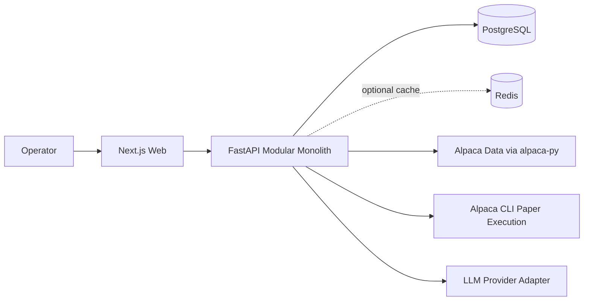
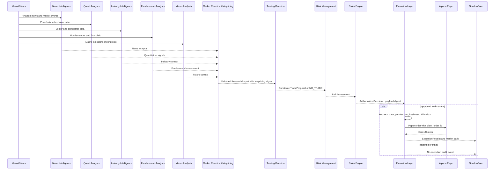

# PRISM — Architecture

**One signal. Multiple perspectives. Better decisions.**

## Purpose

**PRISM** takes a single market signal and autonomously breaks it down through a pipeline of **7 specialist AI agents** (news intelligence, quantitative analysis, industry intelligence, fundamental analysis, macroeconomic analysis, market reaction and mispricing detection, and trading decision synthesis) followed by **2 decision and execution layers** (risk management and execution). Deterministic business rules govern whether a trade can actually proceed, paper orders execute via Alpaca, and ShadowFund audits counterfactual alternatives against subsequent market data. Process integrity, auditability, and clear decision traces take priority over unconstrained speed.

> **One signal → Autonomous perspectives → Governed decisions → Clearer outcomes**

## System context

Only FastAPI crosses the Alpaca and LLM trust boundaries. Browser code receives redacted application data and never broker credentials.

## Governed decision flow

## Backend modules

| Module | Owns | Must not own |
| --- | --- | --- |
| `research` | Multi-agent analysis pipeline output (news, quant, industry, fundamental, macro, mispricing) and `ResearchReport` | Trade authorization or execution |
| `proposal` | Trading decision synthesis, candidate option structure, `TradeProposal`, and `NO_TRADE` | Final risk policy |
| `risk` | Risk management constraints, contextual critique, and modifications | Authoritative permission |
| `rules` | Versioned deterministic evaluation and authorization | LLM judgment |
| `profiles` | Versioned tunable parameters and activation history | Hard rule mutation |
| `market` | Alpaca news/data adapters and normalization | Order placement |
| `portfolio` | Account snapshots and normalized exposure | Strategy invention |
| `execution` | Final checks, CLI translation, reconciliation, and `ExecutionReceipt` | Changing approved intent |
| `shadowfund` | Counterfactual branches and outcome metrics | Live account mutation |
| `audit` | Append-oriented trace events | Editable business state |
| `auth` | Seeded credential authentication, session tokens, route guards | Broker access or strategy decisions |

Shared contracts have no framework or integration dependencies. API routes depend on application services; services depend on ports and domain policies; adapters implement ports.

## Deployment topology

The hackathon deployment is one Next.js container, one FastAPI container, PostgreSQL, optional Redis, and Nginx on a Linux VPS. This is deliberately a modular monolith. Nginx terminates TLS and routes `/api/` to FastAPI and all other traffic to Next.js. PostgreSQL and Redis have no public ports in production.

## User and judge interface flow

The authenticated frontend is organized as a decision journal rather than a collection of backend entity screens:

- **Overview:** Period metrics and charts summarize paper-shaped outcomes, decision states, agent usage, and the best simulated comparison.
- **Decision Story:** One chronology connects the catalyst, reaction evidence, agent decision tree, sanitized transcript, deterministic gate, outcome, ShadowFund branches, and lessons.
- **Portfolio and Alternatives:** A common UTC range compares the illustrative paper path with no-action, reduced-size, unhedged, and agent-alternative branches.
- **News and Agent Observability:** Source-shaped news fixtures link to stories; agent surfaces expose concise rationale, model/prompt metadata, latency, token counts, and used versus planned tools without hidden reasoning.
- **Rules:** Immutable platform controls are explained separately from browser-local business-rule drafts. A fixture preview cannot authorize or activate a ruleset.

During the frontend prototype phase, authentication is the only live product data path. All decision-journal data is fixed fictional data behind typed loaders. The backend system-status endpoint remains available for operations but is not part of user navigation.

## Trust boundaries

1. **Browser to application**: validate inputs; authenticate operator via seeded credentials & HMAC-SHA256 session tokens; expose no provider secrets or raw privileged diagnostics.
2. **AI output to domain**: strict schema validation; invalid output stops the workflow.
3. **Proposal to rules**: deterministic evaluation owns authority.
4. **Authorization to execution**: bind immutable digests and expiration; recheck changing state.
5. **Application to Alpaca**: paper-only environment, idempotency, timeouts, reconciliation, and redacted logs.

## Failure posture

- Missing rules, stale data, unsupported account permissions, invalid AI output, ambiguous environment, or digest mismatch fails closed.
- Alpaca and LLM outages degrade research or execution independently; monitoring and audit remain available.
- Redis is optional. PostgreSQL is authoritative for durable state.
- Automatic profile switching is deferred. Operator authentication is enforced via seeded environment credentials.
