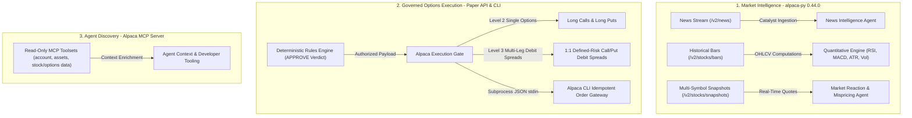

# PRISM — Technology Stack & Alpaca Integration

**One signal. Multiple perspectives. Better decisions.**

PRISM is built as a production-grade, modular financial decision platform that combines modern web engineering, a high-performance Python API, multi-agent AI synthesis, deterministic mathematical governance, and deep integration with the Alpaca ecosystem.

---

## Core Technology Stack

| Layer | Selection | Version / Details | Architectural Role |
| --- | --- | --- | --- |
| **Web Frontend** | Next.js App Router | 16.1.6 (React 19, TypeScript) | Server-rendered, dark cyber-crystalline interface with typed UI boundaries and zero exposed secrets |
| **Styling & Design** | Tailwind CSS & Radix Primitives | Tailwind 4, Lucide Icons | Specular frosted glass, WCAG 2.2 AA compliant typography (Plus Jakarta Sans), and spectral agent accents |
| **Frontend Testing** | Vitest & React Testing Library | Vitest 4 | Fast unit, component, and contract boundary verification |
| **Backend API** | FastAPI | Python 3.12, Pydantic 2 | High-performance asynchronous REST API with auto-generated OpenAPI contracts |
| **Persistence** | PostgreSQL 17 & SQLAlchemy 2 | PostgreSQL 17, Alembic | Transactional domain entities, immutable decision logs, and audit trails |
| **Caching & Queue** | Redis | Optional (v7+) | Ephemeral coordination and caching; never holds execution authority |
| **Python Tooling** | uv, Ruff, mypy, pytest | uv 0.6+, Python 3.12 | Lightning-fast dependency management, static typing, and linting |
| **JS Tooling** | Node.js 24, pnpm 11.24.0 | pnpm monorepo workspace | Strictly locked dependencies and shared scripts |
| **Runtime & Ops** | Docker Compose, Nginx | Multi-stage Docker, Nginx reverse proxy | Reproducible single-VM cloud deployment with SSL/TLS and security headers |
| **CI/CD** | GitHub Actions | Protected environments | Automated linting, contract checks, test suites, and governed branch promotion |

---

## Alpaca Ecosystem Integration

PRISM deeply leverages Alpaca's developer platform across market data ingestion, research intelligence, paper trading execution, and agent tooling:

| Alpaca Component | Endpoints & Scope | PRISM Architectural Role | Safety & Governance Envelope |
| --- | --- | --- | --- |
| **`alpaca-py` Market Data API** | `/v2/news` `/v2/stocks/bars` `/v2/stocks/snapshots` | Ingests real-time catalysts for **News Agent**; feeds OHLCV bars into **Quantitative Engine** (RSI, MACD, Bollinger Bands, ATR); provides live spreads to **Reaction Agent**. | Read-only market intelligence; freshness strictly checked (<= 30s) before any trade proposal. |
| **Alpaca Paper Trading API** | `/v2/orders` `/v2/positions` `/v2/account` | Executes approved option contracts (Level 2 Long Calls/Puts and Level 3 Multi-Leg 1:1 Debit Spreads via `order_class=mleg`). | Restricted to paper endpoints (`paper-api.alpaca.markets`); limit pricing within <= 10% spread; day TIF. |
| **Alpaca CLI (v0.0.13)** | Subprocess order gateway | Secure server-side order submission receiving typed JSON over standard input; handles client-order-id idempotency and disconnect reconciliation. | Prevents shell injection; keeps credentials strictly isolated in backend memory (never exposed to browser or LLMs). |
| **Alpaca MCP Server** | `account`, `assets`, `stock-data`, `options-data`, `news` | Provides structured market and asset discovery tools for developer workflows and research agents. | Read-only tools only; mutating trading tools are excluded to prevent LLMs from bypassing deterministic rules. |

### 1. `alpaca-py` (v0.44.0) — Market Intelligence & Research
- **Historical Stock Bars (`/v2/stocks/bars`)**: Feeds the **Quantitative Agent** to compute 100% deterministic technical indicators, including RSI, MACD, Bollinger Bands, ATR, annualized historical volatility, volume surge, and bounded momentum scores.
- **Multi-Symbol Snapshots (`/v2/stocks/snapshots`)**: Provides real-time pricing and bid/ask quotes to the **Market Reaction / Mispricing Agent** to compare expected vs. observed price moves against historical baseline variance.
- **Alpaca News Feed (`/v2/news`)**: Streams curated market news and corporate press releases to the **News Intelligence Agent** for structured catalyst extraction, source credibility scoring, and sentiment analysis.

### 2. Alpaca Paper Trading API — Governed Options Execution
- **Paper Trading Environment**: Targets Alpaca's dedicated paper endpoints (`https://paper-api.alpaca.markets/v2`). Live trading is strictly prohibited by platform invariants.
- **Supported Option Envelope**:
  - **Level 2 Options**: Single-leg Long Calls and Long Puts.
  - **Level 3 Options**: Multi-leg 1:1 defined-risk Long Call Debit Spreads and Long Put Debit Spreads (`order_class=mleg`).
- **Order Discipline**: Enforces whole-contract sizing, standard OCC contract symbology, limit pricing within active spreads (<= 10% of premium), and `day` time-in-force. Naked shorts, credit spreads, and equity legs are deterministically rejected.

### 3. Alpaca CLI (v0.0.13) — Subprocess-Isolated Order Gateway
- Executes authorized paper orders via a secure child process taking JSON on standard input.
- Prevents command injection and ensures API credentials remain isolated in server environment memory.
- Uses `client_order_id` binding to ensure idempotent submissions and robust reconciliation during network timeouts or disconnects.

### 4. Alpaca MCP (Model Context Protocol) Server — Agent Discovery
- Exposes structured read-only toolsets (`account`, `assets`, `stock-data`, `options-data`, and `news`) for developer investigation and agent context enrichment.
- Excludes mutating trading tools to guarantee that no AI model can bypass the deterministic Rules Engine.

---

## Provider-Neutral AI / LLM Layer

PRISM decouples agent logic from specific LLM providers via a unified, provider-neutral gateway:

- **Supported Providers**: DeepSeek (DeepSeek-V4-Flash), Anthropic (Claude 3.5 Sonnet), Google Gemini (Gemini 2.5/3.0), OpenAI (GPT-4o), Featherless AI, and local Ollama models.
- **Structured Outputs**: All agents use Pydantic schemas and strict JSON Schema enforcement.
- **Fail-Closed Validation**: Stale, incomplete, or unparseable AI responses automatically fail closed, preventing hallucinated or invalid trade proposals from reaching downstream stages.
- **Observability**: Records latency, token consumption, agent version, prompt version, and confidence metrics without persisting hidden chain-of-thought tokens.
