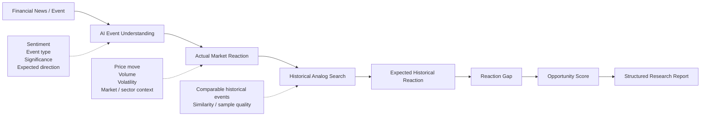
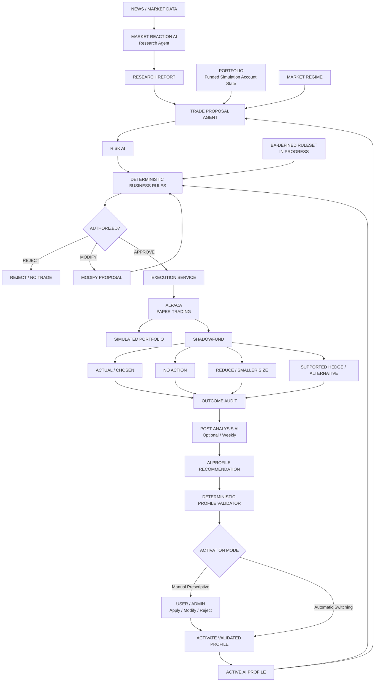
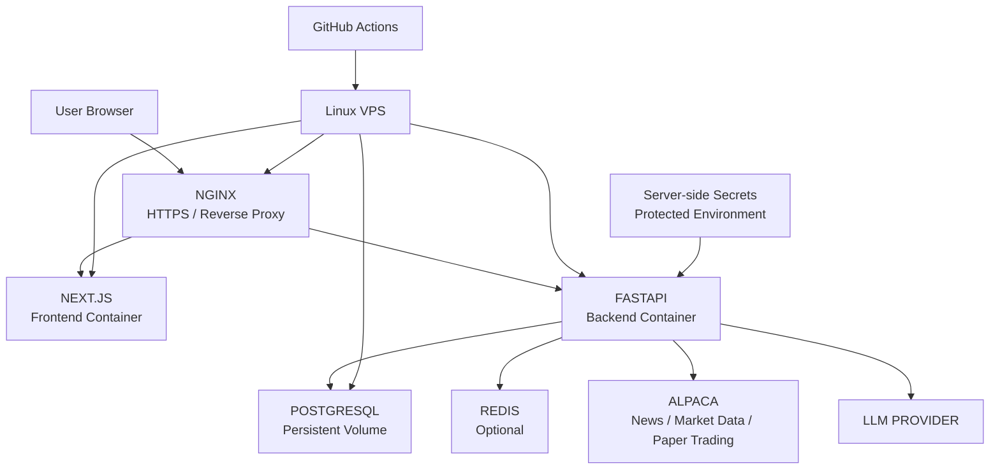

# PRISM — Project Concept

> **System / App Name:** PRISM  
> **Tagline:** One signal. Multiple perspectives. Better decisions.  
> **Core Metaphor:** Optical Dispersion / Multi-Perspective Analysis  
> **Working Components:** Market Reaction AI + ShadowFund  
> **Hackathon:** Alpaca AI Trading Agents Hackathon  
> **Version:** 2.2  
> **Deployment:** Linux VPS  
> **Primary Stack:** Next.js + FastAPI  
> **Trading Environment:** Supplied funded simulation/paper account  
> **Deterministic Business Rules:** BA — IN PROGRESS

## Core Thesis & The PRISM Concept

**PRISM** is inspired by how an optical prism takes a single beam of light and separates it into different wavelengths, revealing what was previously unseen.

In the same way, **PRISM takes a single market signal and autonomously breaks it down into multiple perspectives**. Its AI agents analyze the catalyst, market reaction, historical patterns, potential strategies, risks, and alternative outcomes—while deterministic rules govern whether a trade can actually proceed.

The prism represents **PRISM’s autonomous intelligence**: rather than relying on one interpretation or one AI decision, it continuously examines the same signal from different angles, challenges its own conclusions, and learns from what actually happened versus what could have happened.

> **One signal → Autonomous perspectives → Governed decisions → Clearer outcomes**

### Important Project Status

- **System / Application Name:** Confirmed as **PRISM** with tagline *"One signal. Multiple perspectives. Better decisions."*.
- The trading account will be a **funded simulation/paper account supplied for the hackathon**; simulated capital amount, starting holdings, permissions, and reset behavior remain TBD until the account is provided.
- The **Business Analyst is still defining the deterministic/business rules and thresholds**. Numeric examples are illustrative only until BA sign-off.
- **Next.js + FastAPI** is the primary application stack.
- Deployment will use a **Linux VPS with Docker Compose and Nginx/reverse proxy**.
- **ShadowFund** remains the confirmed working name for the counterfactual intelligence and audit layer.

## 00 Project Status & Snapshot

This revision updates the earlier portfolio-defense concept into a broader governed market-reaction trading system. The key strategy is now Market Reaction AI: identify when the market may have overreacted or underreacted to meaningful information, then allow the rest of the platform to determine whether and how that opportunity can be acted on.

### Decision status

| Area | Current status | Implementation note |
| --- | --- | --- |
| System / app name | CONFIRMED (PRISM) | Tagline: *"One signal. Multiple perspectives. Better decisions."* |
| Market Reaction AI strategy | CONFIRMED | Primary research and opportunity-discovery approach. |
| Alpaca funded simulation account | CONFIRMED / DETAILS TBD | Use supplied paper account; virtual capital amount and initial holdings pending. |
| Deterministic / business rules | PENDING BA SIGN-OFF | Implement a configurable rules engine; do not lock example thresholds as final. |
| ShadowFund intelligence layer | CONFIRMED AS WORKING CONCEPT | Tracks counterfactual alternatives and audit history. |
| Frontend / backend | CONFIRMED | Next.js + TypeScript; FastAPI + Python. |
| Infrastructure | CONFIRMED | Linux VPS deployment; Docker Compose + reverse proxy. |
| Post-analysis AI | OPTIONAL | Weekly decision review / recommendation layer. |
| Automatic AI Profile switching | OPTIONAL | Weekly profile changes may be auto-applied only within BA-approved configurable bounds. |
| Manual Prescriptive mode | OPTIONAL | Post-Analysis AI recommends profile/rule-parameter changes; user/admin applies, edits, or rejects them. |

> **Working system rule**
>
> Research finds the mismatch. Proposal converts it into an action. Risk AI challenges it. Business rules authorize it. Execution submits it. ShadowFund proves or disproves the decision.

### Key terms

| Term | Working definition |
| --- | --- |
| AI Profile | A versioned set of tunable strategy and risk parameters used by the Proposal/Risk/Rules pipeline. Post-Analysis AI may recommend a new profile weekly. In Manual Prescriptive mode, a user/admin reviews and applies it; with Automatic AI Profile Switching enabled, an approved profile can become active automatically. AI Profiles may adjust only parameters the BA explicitly marks as profile-configurable and must remain inside hard deterministic-rule boundaries. |
| Portfolio | The actual state of the supplied Alpaca simulation account: virtual cash, holdings, buying power, open orders, realized/unrealized P&L, concentration, and exposure. The Portfolio is account state; it is not the same as the AI Profile. |
| Deterministic / Business Rules | BA-defined executable constraints that produce authoritative PASS/MODIFY/FAIL or APPROVE/MODIFY/REJECT results. Hard rules cannot be rewritten by AI. Some rule parameters may be exposed as profile-configurable ranges if the BA explicitly approves that behavior. |
| Post-Analysis AI | A weekly/on-demand analysis agent that reviews live-paper outcomes, Research/Proposal/Risk history, deterministic-rule results, and ShadowFund counterfactuals, then produces explainable recommendations for the next AI Profile version. |
| ShadowFund | Counterfactual intelligence and audit layer that tracks realistic alternatives using the same subsequent market path and feeds evidence into post-analysis. |

> **AI Profile vs deterministic rules**
>
> The AI Profile should tune behavior inside the rules, not bypass or silently rewrite the rules. Example: a hard BA rule may cap any single position at 20%; an AI Profile may choose an effective target of 8%, 12%, or 15%, but never exceed the 20% hard cap.

### Document contents

| Section | Topic |
| --- | --- |
| 01 | Problem & Opportunity |
| 02 | Solution Concept |
| 03 | Market Reaction AI — Research Agent |
| 04 | Trade Proposal Agent |
| 05 | Risk AI + Deterministic Business Rules |
| 06 | Trade Execution & Simulated Account |
| 07 | ShadowFund Intelligence Layer |
| 08 | End-to-End Workflows |
| 09 | System Architecture |
| 10 | Data Model & API Contracts |
| 11 | VPS Deployment & Security |
| 12 | Dashboard / UX |
| 13 | Hackathon MVP & Demo |
| 14 | Development Workstreams |
| 15 | Success Metrics |
| 16 | Risks, Limitations & Ethics |
| 17 | Open BA / Product Decisions |
| 18 | Roadmap & Pitch |

## 01 Problem & Opportunity

### The problem

Significant financial news can move a stock immediately, but price movement does not always match the information value of the event. A strong positive earnings surprise can receive only a small price response, while relatively minor negative news can trigger an outsized sell-off. Traders may interpret these mismatches as potential underreactions or overreactions, but identifying them manually requires continuous monitoring of news, price, volume, volatility, market context, and historical analogs.

- Simple news-sentiment bots reduce the strategy to “positive news → buy” or “negative news → sell,” ignoring whether the market has already priced the information correctly.
- A reaction can look unusual in isolation but be normal once sector movement, market volatility, volume, and prior behavior are considered.
- Historical comparisons are time-consuming and can be inconsistent when performed manually.
- Even a valid opportunity can be a poor portfolio decision when exposure, cash, daily losses, liquidity, or other business rules make the action unsuitable.
- AI reasoning is probabilistic. Execution authority should remain with deterministic, testable, auditable business logic.

### Opportunity

The product differentiates itself by asking a more disciplined question: “Did the market react appropriately to the information, and if not, is the mismatch actionable within the account’s risk mandate?” The innovation is not only the AI analysis; it is the full governed decision chain from evidence to proposal to risk review to rule authorization to simulated execution to counterfactual audit.

## 02 Solution Concept

The platform is a modular trading-intelligence system built around five connected responsibilities. Each layer has a distinct authority boundary so that research, decision formation, risk review, business-rule enforcement, and execution can be developed and tested independently.

| Layer | Primary responsibility | Key output |
| --- | --- | --- |
| Market Reaction AI | Analyze significant news and measure whether the market appears to have overreacted or underreacted. | Structured Research Report / Opportunity Assessment |
| Trade Proposal Agent | Turn research evidence into a candidate action using portfolio context and supported instruments. | Trade Proposal |
| Risk AI | Critique the proposal using qualitative/contextual risk analysis. | Risk Assessment |
| Deterministic Rules Engine | Apply BA-defined business constraints and return an authoritative decision. | APPROVE / MODIFY / REJECT + rule trace |
| Execution Service | Re-check execution-critical conditions and submit only authorized orders. | Execution Receipt / Order State |
| ShadowFund | Track realistic alternatives using the same market path and build an auditable decision history. | Counterfactual Outcome Audit |

> **Separation of authority**
>
> The Research Agent must not directly place an Alpaca order. The Execution Service must not invent a trade. The deterministic business-rule layer is the final authorization gate.

## 03 Market Reaction AI — Research Agent

Market Reaction AI is the strategy and research brain of the system. Its purpose is to discover evidence of a possible reaction mismatch—not to make an executable trading decision. The agent combines AI interpretation with deterministic market calculations so that qualitative understanding and quantitative measurements remain distinguishable.

*Figure 1. Market Reaction AI research pipeline.*

### Research stages

| Stage | Responsibility | Implementation emphasis |
| --- | --- | --- |
| Detect event | Receive or poll relevant Alpaca financial news and identify symbol/company, event time, source, and event category. | API ingestion + deduplication + relevance filter |
| Understand event | Classify positive/negative/mixed, event type, significance, expected direction, assumptions, and uncertainty. | LLM with structured output schema |
| Measure reaction | Calculate pre/post-event price movement, volume ratio, volatility, market/sector movement, and timing. | Deterministic Python calculations |
| Find historical analogs | Retrieve comparable historical events and reactions using event type, symbol/company, surprise magnitude when available, and regime context. | Historical-data query + similarity scoring |
| Calculate reaction gap | Compare expected historical reaction with the current actual reaction. | Deterministic calculation; methodology versioned |
| Score opportunity | Classify potential UNDERREACTION / OVERREACTION / NO CLEAR EDGE with confidence and evidence quality. | Weighted scoring + AI explanation |

### Recommended Research Report contract

| Field group | Examples |
| --- | --- |
| Identity | research_id, symbol, timestamp, event_type, source_ids |
| AI interpretation | sentiment, significance_score, expected_direction, uncertainty, rationale_summary |
| Observed reaction | actual_reaction_pct, volume_ratio, volatility, sector_move, market_move |
| Historical evidence | analog_count, expected_reaction_pct, median_reaction_pct, similarity_score, sample_window |
| Opportunity output | reaction_gap_pct, classification, opportunity_score, confidence, assumptions |

> **Important boundary**
>
> Research output should describe evidence such as “Potential bullish underreaction, opportunity score 84/100.” It should not contain brokerage credentials, direct Alpaca calls, or an instruction that bypasses Proposal/Risk/Rules layers.

## 04 Trade Proposal Agent

The Proposal Agent converts a Research Report into a concrete candidate action. It is the first component allowed to discuss instruments, direction, candidate size, entry logic, and exit intent—but the proposal is still untrusted until Risk AI and deterministic rules complete their checks.

### Inputs

- Market Reaction AI Research Report.
- Current simulated portfolio: positions, cash, buying power, open orders, realized/unrealized P&L.
- Active AI Profile, plus any user/account preferences that the BA allows.
- Current market regime and execution conditions.
- Supported instrument set for the MVP (to be finalized with BA/product team).

### Candidate outputs

| Outcome | Example | Meaning |
| --- | --- | --- |
| NO TRADE | Research is interesting but evidence quality is weak or portfolio fit is poor. | Explicitly valid decision; no execution path created. |
| BUY / ADD | Small long exposure to a potential bullish underreaction. | Candidate only; size subject to rules. |
| SELL / REDUCE | Reduce or exit exposure after a potential negative reaction mismatch or portfolio risk issue. | Candidate only. |
| HEDGE | Use a supported defined-risk defensive structure if enabled. | Optional/MVP-dependent; must be rule-approved. |

### Proposal contract

Every proposal should be machine-readable and versioned. Recommended fields: proposal_id, research_id, symbol, action, instrument_type, quantity or allocation intent, entry_type, exit_plan, time_horizon, confidence, rationale_summary, expected_thesis, assumptions, and expiration/valid-until timestamp.

> **Why this separation matters**
>
> The same research evidence may produce different proposals depending on the portfolio. A bullish reaction gap does not automatically justify adding the same stock if the account is already highly concentrated in it.

## 05 Risk AI + Deterministic Business Rules

Risk governance is intentionally split into two layers. Risk AI performs contextual critique; the deterministic business-rule engine makes the authoritative policy decision. This protects execution from an LLM that may sound confident but violate account rules.

### Risk AI responsibilities

- Challenge the research thesis and identify contradictory evidence.
- Assess portfolio concentration, correlation, event uncertainty, market regime, and qualitative tail risks.
- Identify whether the trade increases or decreases portfolio fragility.
- Recommend modifications such as smaller size, delayed entry, alternative instrument, or NO TRADE.
- Produce a bounded structured Risk Assessment rather than free-form execution instructions.

### Deterministic rules: current status

> **BA work in progress**
>
> The Business Analyst is currently defining the actual business rules and numeric thresholds. The architecture must support configurable, versioned rules. The examples below are categories only; they are NOT approved requirements and must not be treated as final values.

| Rule category | Possible rule behavior | Status |
| --- | --- | --- |
| Position / concentration | Reject or resize a proposal that would exceed a configured exposure limit. | THRESHOLD TBD BY BA |
| Trade size / notional | Cap how much simulated capital one decision may deploy. | THRESHOLD TBD BY BA |
| Cash / buying power | Ensure sufficient buying power and preserve any required cash buffer. | RULE TBD BY BA |
| Daily loss / drawdown | Pause or restrict new risk after a configured loss threshold. | THRESHOLD TBD BY BA |
| Open-position count | Limit concurrent positions or proposals. | RULE TBD BY BA |
| Stop-loss / take-profit | Require or validate exit parameters when the business strategy mandates them. | RULE TBD BY BA |
| Instrument permissions | Allow only supported stocks/ETFs/options strategies for the current mode. | RULE TBD BY BA |
| Market-data freshness | Prevent execution using stale quotes or expired research. | RULE TBD BY BA |
| Event / volatility regime | Adjust the effective risk envelope when a major event or volatility condition is active. | DESIGN + RULE TBD |
| Kill switch | Stop new executions while monitoring and audit remain active. | LIKELY CORE CONTROL; BA TO CONFIRM |

### Three-level governance model

| Level | Owner / authority | Concept |
| --- | --- | --- |
| 1. Platform hard limits | Engineering + product governance | Non-bypassable technical/safety constraints. Neither AI Profiles nor users can weaken them. |
| 2. Deterministic business rules | Business Analyst / product | Versioned business logic, ceilings/floors, permissions, precedence, and approved configurable ranges. These rules authorize, modify, or reject proposals. |
| 3. Active AI Profile | Post-Analysis AI recommendation + user/system activation | Versioned tunable parameters operating inside Levels 1–2, such as opportunity threshold, sizing preference, confidence floor, event preference, or a stricter effective exposure target. |

Market regime is an additional runtime input, not permission to bypass the three levels. A volatile/event/crisis state may trigger BA-approved tightening or defensive behavior, but the active AI Profile must still remain inside deterministic business-rule boundaries.

> **What the AI Profile may change**
>
> The BA should explicitly mark which parameters are profile-configurable and define valid ranges. The weekly Post-Analysis AI may recommend new values only for those fields. Hard rule logic and absolute ceilings/floors remain outside AI control.

## 06 Trade Execution & Funded Simulation Account

The hackathon will provide a funded simulation/paper account that the system can use to place trades. The account contains simulated capital; the amount, starting positions, and any organizer-imposed constraints are still pending. The MVP should treat this environment as the only execution target.

### Execution Service responsibilities

1. Receive an APPROVED or approved-with-modification Trade Proposal from the rules engine.

2. Fetch the latest account state, buying power, market status, and quote needed for execution.

3. Re-run execution-critical deterministic checks that could have changed since approval.

4. Translate the approved proposal into a broker order using Alpaca Trading API/MCP capabilities.

5. Submit the paper order and capture broker order ID, status, fills, prices, timestamps, and errors.

6. Reconcile the resulting simulated position with the portfolio snapshot and write an audit event.

7. Never alter trade intent or size outside the approved parameters.

### Simulation-account assumptions to keep configurable

| Item | Current state |
| --- | --- |
| Initial virtual balance | $100,000.00 USD (Competition account baseline) |
| Initial holdings | TBD |
| Permitted assets | TBD / validate against Alpaca and hackathon instructions |
| Options enablement | TBD |
| Order types | TBD; implement only what the MVP needs |
| Market-hours behavior | Configurable intraday trading windows within the regular 9:30 AM – 4:00 PM ET market boundary |
| Live-money execution | OUT OF SCOPE for hackathon MVP |

> **Execution principle**
>
> AI components never receive direct authority to bypass business rules. Only the Execution Service can submit an Alpaca paper order, and only after a valid authorization result.

## 07 ShadowFund — Counterfactual Intelligence & Audit Layer

ShadowFund is the intelligence layer that records what the system considered and measures whether the chosen intervention was better than realistic alternatives. It turns each major decision into an auditable experiment rather than evaluating success only by realized P&L.

### Core behavior

- Creates shadow portfolios whenever a major proposal is approved, rejected, or otherwise flagged for evaluation.
- Tracks counterfactual choices such as do nothing, reduce exposure, or use a supported defined-risk hedge.
- Uses the same subsequent market path and timestamped market data to mark alternative positions over time.
- Compares actual simulated execution with alternatives on return, drawdown, risk, capital usage, and other agreed metrics.
- Stores an auditable learning history that future analysis can query without silently changing deterministic rules.

### Typical branches

| Branch | Example | Purpose |
| --- | --- | --- |
| Actual / chosen action | The approved trade placed in the funded simulation account. | Reference path. |
| No-action baseline | Keep portfolio unchanged. | Measures whether intervention added value. |
| Reduced-size branch | Take a smaller version of the proposal or reduce existing exposure. | Tests whether less risk would have been sufficient. |
| Hedge branch | Use a supported defined-risk alternative. | Tests protection / alternative implementation. |
| Contrarian / Persona branch | Single-prompt extracted counter-thesis (e.g. fade rally). | Tests divergent market perspectives with zero token overhead. |

### Audit metrics

| Metric | Definition |
| --- | --- |
| Counterfactual Alpha | Chosen/actual return minus no-action baseline return. |
| Decision Regret | Best tracked alternative outcome minus chosen outcome. |
| Protection Value | Loss avoided versus baseline during a stress period. |
| Risk-Adjusted Outcome | Return evaluated alongside drawdown/volatility/capital-at-risk. |
| Rule Quality Signal | Whether a rejected/modified action later appeared materially riskier or safer. |
| Research Calibration | Whether high-confidence reaction-gap signals historically performed better than lower-confidence signals. |

### Optional intelligence features

- Post-Analysis AI Agent (Weekly): reviews the previous week of research signals, proposals, executed paper trades, rule outcomes, Portfolio behavior, and ShadowFund counterfactual results. It produces a versioned recommendation for the next AI Profile and explains which parameters it wants to tighten, loosen, or keep unchanged.
- Automatic AI Profile Switching: if enabled, the system can activate the next recommended AI Profile on a weekly schedule after validation against BA-approved parameter ranges and hard deterministic rules. The automatic feature changes only profile-configurable values; it cannot alter immutable business rules.
- Manual Prescriptive Mode: the Post-Analysis AI generates a recommended AI Profile or specific parameter changes, but a user/admin must Apply, Modify, or Reject the recommendation before it becomes active.

### Weekly AI Profile lifecycle

1. ShadowFund and the audit layer close the configured evaluation windows for recent decisions.

2. Post-Analysis AI reviews outcomes, counterfactuals, decision regret, research calibration, risk events, and rule traces.

3. The agent creates an AIProfileRecommendation with proposed parameter changes, evidence, expected effect, and confidence.

4. A deterministic Profile Validator checks every proposed value against BA-approved min/max ranges and non-bypassable hard rules.

5. In Manual Prescriptive mode, a user/admin reviews and applies, edits, or rejects the recommendation.

6. If Automatic AI Profile Switching is enabled, a recommendation that passes all required validations may be activated as the next version automatically.

7. Every activation records previous_profile_id, new_profile_id, recommendation_id, activation mode, and timestamp for auditability.

> **Learning boundary**
>
> Post-Analysis AI can recommend or select values only inside BA-approved configurable ranges. It must never silently rewrite rule logic, remove hard limits, or expand a parameter beyond its deterministic ceiling. Changes to rule definitions themselves remain a BA/product-controlled, versioned engineering change.

## 08 End-to-End Workflows

### A. Opportunity workflow

1. Alpaca news/market data surfaces a significant company or market event.

2. Market Reaction AI classifies the event and measures the immediate market response.

3. Historical analog analysis estimates a typical reaction and computes a reaction gap.

4. If evidence quality is sufficient, the Research Agent emits an Opportunity Assessment; otherwise it records NO CLEAR EDGE.

5. Proposal Agent combines the research with current portfolio/account context and emits a candidate action or NO TRADE.

6. Risk AI critiques the action and returns a structured Risk Assessment.

7. Deterministic business rules return APPROVE, MODIFY, or REJECT with a rule-by-rule trace.

8. Execution Service submits only an authorized Alpaca paper order.

9. ShadowFund creates alternatives and tracks them alongside the simulated portfolio.

10. Outcome Audit and optional Post-Analysis AI evaluate decision quality after a configured horizon.

### B. High-volatility / event workflow

Major events should not create an AI “rule bypass.” Instead, the market-regime layer can activate a BA-approved dynamic risk policy. The effective limits may tighten for speculative risk while defensive permissions may expand, but Level 1 hard limits remain non-bypassable.

### C. No-trade workflow

NO TRADE is a first-class outcome. The platform should record the research, proposal/risk rationale, failed or unmet rule conditions, and any shadow baseline needed for later calibration. This avoids pressuring the system to trade merely to create activity.

## 09 System Architecture

For the hackathon, use a modular monolith rather than several independently deployed microservices. The frontend is one Next.js application and the backend is one FastAPI application, but the backend is separated into modules with explicit interfaces so developers can work in parallel and the system can later split into services if needed.

*Figure 2. End-to-end logical architecture.*

### Suggested FastAPI module boundaries

| Module | Owns |
| --- | --- |
| research | Market Reaction AI orchestration, event understanding, historical analogs, opportunity scoring. |
| proposal | TradeProposal creation, candidate instrument/action selection, proposal expiration. |
| risk | Risk AI assessment and portfolio-context critique. |
| rules | Deterministic business-rule registry, rule versions, evaluation, decisions, and profile-validation bounds. |
| profiles | AI Profile versions, active profile, profile recommendations, activation history, manual/automatic switching. |
| portfolio | Account snapshots, positions, P&L, exposure normalization. |
| market | Alpaca news/market-data adapters, historical-data access, caching. |
| execution | Authorized order translation, submission, reconciliation, kill switch. |
| shadowfund | Counterfactual branches, virtual positions, mark-to-market, metrics. |
| audit | Append-only-ish decision events, trace IDs, timeline queries. |
| shared | Pydantic contracts, enums, auth, error model, observability helpers. |

### Suggested repository shape

frontend/ app/ components/ features/ lib/ types/ backend/ app/api/ app/agents/research/ app/agents/proposal/ app/agents/risk/ app/core/rules/ app/services/alpaca/ app/services/portfolio/ app/services/execution/ app/services/shadowfund/ app/services/audit/ app/models/ app/schemas/ tests/ infra/ vps/ docker/ nginx/ github-actions/

## 10 Data Model & API Contracts

The main integration risk in a multi-developer hackathon is inconsistent object shapes. Freeze a small set of shared Pydantic/TypeScript contracts early so each workstream can develop against mocks.

### Core domain records

| Record | Purpose | Key relationships |
| --- | --- | --- |
| AIProfile | Versioned tunable strategy/risk configuration used within deterministic limits. | profile_id + version + active status |
| AIProfileRecommendation | Weekly/manual recommendation from Post-Analysis AI. | source profile → proposed profile |
| ResearchReport | Evidence produced by Market Reaction AI. | event_id → research_id |
| TradeProposal | Candidate action derived from research, portfolio context, exit policy, and shadow perspectives. | research_id → proposal_id |
| ShadowCandidate | Single-prompt extracted alternative or contrarian candidate for multiverse evaluation. | embedded in TradeProposal |
| ExitPolicy | Deterministic take-profit, stop-loss, DTE limit, and holding duration rules. | embedded in TradeProposal |

| RiskAssessment | Risk AI critique. | proposal_id → risk_assessment_id |
| RuleEvaluation | Individual deterministic check and result. | proposal_id + ruleset_version |
| AuthorizationDecision | APPROVE / MODIFY / REJECT authoritative result. | proposal_id → decision_id |
| ExecutionReceipt | Alpaca paper order/fill/reconciliation. | decision_id → broker_order_id |
| ShadowSession | Actual branch + alternatives and evaluation horizon. | proposal_id / execution_id |
| AuditEvent | Timestamped event in the decision lifecycle. | trace_id across all records |

### Recommended API surface

| Method / route | Responsibility |
| --- | --- |
| POST /research/analyze-event | Create/refresh a Market Reaction AI analysis for a detected event. |
| GET /research/{id} | Retrieve structured research and evidence. |
| POST /proposals | Create candidate TradeProposal from research + portfolio snapshot. |
| POST /proposals/{id}/risk | Run Risk AI assessment. |
| POST /proposals/{id}/authorize | Evaluate deterministic rules against current ruleset. |
| POST /proposals/{id}/execute | Execute only a valid authorization decision. |
| GET /portfolio | Current simulation account and normalized portfolio state. |
| GET /shadow/{session_id} | Actual vs counterfactual branches and metrics. |
| GET /audit/{trace_id} | Full decision timeline. |
| GET /rulesets/current | Current active BA-approved ruleset and version metadata. |
| GET /profiles/current | Current active AI Profile and effective tunable parameters. |
| GET /profiles/recommendations | Post-Analysis AI profile recommendations and evidence. |
| POST /profiles/recommendations/{id}/apply | Manual Apply/Modify/Reject workflow for a profile recommendation. |

> **Contract rule**
>
> Every AI endpoint must use strict structured output validation. Invalid or incomplete AI responses fail closed and do not progress to execution.

## 11 VPS Deployment, Security & Observability

The hackathon deployment will use a Linux VPS. Keep the production topology simple: Dockerize the Next.js frontend and FastAPI backend, run PostgreSQL on the VPS for the hackathon unless a separate database is provided, place Nginx in front as the reverse proxy, and use Docker Compose for orchestration. This minimizes cloud-service overhead while preserving clean deployment boundaries.

*Figure 3. Recommended VPS deployment.*

| Layer | Recommended VPS choice | Purpose |
| --- | --- | --- |
| Operating system | Ubuntu LTS or equivalent Linux | Stable host for Docker and deployment tooling. |
| Reverse proxy | Nginx | TLS termination, domain routing, frontend/backend proxying, request-size/time-out controls. |
| Frontend | Next.js Docker container | Responsive dashboard and server-rendered/web application. |
| Backend | FastAPI Docker container | Modular-monolith API, AI orchestration, rules, execution, ShadowFund, audit. |
| Database | PostgreSQL container / VPS-hosted PostgreSQL | Core application, profiles, rules metadata, audit, and shadow state. |
| Cache/queue | Redis container (optional) | Caching, throttling, lightweight background-job coordination if needed. |
| TLS | Let's Encrypt / Certbot | HTTPS certificates for public demo access. |
| Secrets | Root-owned environment file or Docker secrets | Alpaca, LLM, DB credentials; never shipped to the browser or committed. |
| CI/CD | GitHub Actions + SSH/deploy script | Build/test and deploy Docker Compose updates to the VPS. |
| Observability | Structured app logs + Docker logs + health endpoints | Request correlation, errors, rule/execution traces; add Prometheus/Grafana only if time permits. |

### Recommended Docker Compose services

- nginx — public 80/443 entry point, TLS, routing to frontend/backend.
- frontend — Next.js application.
- backend — FastAPI modular monolith.
- postgres — application database with a persistent volume.
- redis — optional cache/queue service.

### Security principles

- Store Alpaca and LLM credentials only on the VPS server side; never expose them through Next.js client bundles or commit them to Git.
- Frontend never calls Alpaca order endpoints directly. All execution passes through FastAPI authorization and the active deterministic ruleset.
- Use HTTPS, firewall rules, SSH keys, disabled password SSH where feasible, and expose only required public ports.
- Keep PostgreSQL and Redis on private Docker networks rather than publicly exposed VPS ports.
- Use server-side authentication/role checks for privileged profile, ruleset, execution, and admin routes.
- Use idempotency and Alpaca reconciliation to reduce duplicate-order risk.
- Back up PostgreSQL data/configuration before major demo changes and retain decision/audit logs needed for judging.

## 12 Dashboard & User Experience

The dashboard should make the reasoning chain visible enough that judges and teammates can understand why a trade was or was not executed. The UI should emphasize evidence, governance, and audit—not only a P&L chart.

| View | Primary content |
| --- | --- |
| Market Reaction Feed | Detected news/events, symbol, significance, actual reaction, historical expected reaction, reaction gap, opportunity score. |
| Visual Decision Explainer | Interactive 4-stage decision pipeline from news ingestion to counterfactual audit. |
| Research Detail | Article summary, event classification, analogs, charts, assumptions, evidence quality. |
| Proposal Review | Candidate action, thesis, allocation intent, exit plan, portfolio context. |
| Risk & Rules | Risk AI critique + rule-by-rule PASS / MODIFY / FAIL trace + active ruleset version. |
| Portfolio Command Center | Virtual balance, holdings, buying power, exposure, P&L, open orders, and active AI Profile. |
| Execution Timeline | Proposal → risk → authorization → Alpaca order/fill/reconcile timestamps. |
| ShadowFund Audit | Actual branch versus no-action/reduce/hedge alternatives and decision metrics. |
| AI Profile & Rules | Active AI Profile, weekly recommendations, activation history, and read-only deterministic rules; editing rights remain BA/product-defined. |

### Visual Decision Explainer (Core Demo Interface)

The primary operator and judge interface organizes the autonomous trading pipeline into four transparent, sequential panels:

1. **Panel 1: News Catalyst & Event Classification:**
   - Real-time or replayed Alpaca News headline, source, timestamp, and affected symbols.
   - LLM-extracted event category (e.g. *Earnings Surprise*, *Macro Data*, *Product Catalyst*).
   - Significance score (0–100), sentiment direction, and confidence bounds.

2. **Panel 2: Market Reaction & Reaction Gap Visualizer:**
   - *Observed Market Reaction:* Immediate post-event price move ($\Delta P_{\text{actual}}$) and volume ratio.
   - *Expected Historical Reaction:* Benchmark reaction ($\Delta P_{\text{expected}}$) derived from the median of historical analogs.
   - *Visual Reaction Gap:* Delta progress bar highlighting whether the asset is in an **Overreaction**, **Underreaction**, or **Efficiently Priced** state.

3. **Panel 3: Deterministic Governance & Rules Authorization Gate:**
   - Live checklist of all required account and safety constraints:
     - Level 2/3 Options Permission Verified.
     - Sizing within maximum notional cap ($\le 5.0\%$ of $100k balance).
     - Regular market hours / active intraday trading window confirmed.
     - Quote freshness verified ($< 60\text{s}$).
     - Cryptographic SHA-256 digest binding confirmed.
   - Explicit `AUTHORIZATION_ACCEPTED` state badge with expiration timer.

4. **Panel 4: Alpaca Execution & ShadowFund Counterfactual Audit Matrix:**
   - Broker execution receipt with Alpaca CLI order ID and fill price.
   - Live comparative table against parallel counterfactual branches:
     - **Actual Branch:** Chosen Option Debit Spread.
     - **Baseline Branch:** Do Nothing / 100% Cash.
     - **Reduced Size Branch:** Half-sized allocation.
     - **Unhedged Alternative:** Single-leg naked/long position.
   - Real-time metrics: **Counterfactual Alpha**, **Decision Regret**, and **IV Crush Protection Value**.

## 13 Hackathon MVP & Flagship Demo

### MVP priorities

| Priority | Feature | Definition of done |
| --- | --- | --- |
| P0 | Funded simulation account integration | Connect supplied Alpaca paper account; sync virtual cash, positions, orders, and market data. |
| P0 | Market Reaction AI | Process a supported news event and produce structured significance, reaction gap, analog evidence, and opportunity score. |
| P0 | Proposal Agent | Generate a structured candidate action or NO TRADE from research + portfolio context. |
| P0 | Risk AI | Produce bounded structured contextual risk assessment. |
| P0 | Deterministic rules engine | Load versioned BA-configured rules and return rule trace + APPROVE/MODIFY/REJECT. |
| P0 | Execution Service | Submit/reconcile only approved paper orders. |
| P0 | ShadowFund | Track actual/no-action + at least two alternative branches. |
| P0 | Audit timeline | Display end-to-end trace for one proposal. |
| P1 | Historical analog visualization | Show comparable past events/reactions. |
| P1 | Post-Analysis AI | Generate a weekly/on-demand AIProfileRecommendation from audit + ShadowFund outcomes. |
| P1 | Manual Prescriptive mode | Allow Apply / Modify / Reject of a recommended AI Profile. |
| P2 | Automatic AI Profile switching | Activate validated weekly recommendations automatically only after BA confirms configurable ranges and transition rules. |

### Flagship demo scenario

1. A significant earnings/news event is detected for a selected stock.

2. Market Reaction AI shows the event is high significance and the actual move is materially smaller or larger than historical analogs.

3. The dashboard highlights the reaction gap and produces an Opportunity Assessment.

4. Proposal Agent creates a candidate action using the funded simulation account’s current portfolio context.

5. Risk AI critiques the proposal and surfaces uncertainty / exposure issues.

6. Deterministic rules evaluate the proposal using the latest BA-approved ruleset. The demo shows every PASS/MODIFY/FAIL result.

7. Execution Service submits the approved order to Alpaca paper trading and shows the broker receipt.

8. ShadowFund creates no-action, reduced-size, and hedge/alternative branches.

9. After a replayed or subsequent market path, the audit page compares outcomes and explains whether the chosen decision added value.

> **Demo reliability**
>
> Do not rely entirely on a live breaking-news event during judging. Support a replay/simulation fixture using timestamped historical news + market data so the entire pipeline can be demonstrated deterministically, while the funded paper account is still used for the actual paper order portion.

## 14 Development Workstreams & Task Distribution

The architecture is intentionally structured so different developers can work in parallel. Agree on shared schemas first, then allow each workstream to develop behind stable interfaces and mock data.

| Workstream | Primary ownership | Deliverables / tasks |
| --- | --- | --- |
| Frontend / UX | Next.js developer(s) | Dashboard shell; Market Reaction feed/detail; proposal/risk review; portfolio; audit timeline; ShadowFund comparison; API client/types. |
| Research AI | AI/Python developer | News ingestion; event classification; significance; market-reaction calculations; historical analog retrieval; reaction-gap score; ResearchReport schema/tests. |
| Proposal + Risk AI | AI/backend developer | TradeProposal generation; NO TRADE path; RiskAssessment agent; structured outputs; prompt/version management; mocks. |
| Rules + AI Profiles | Backend developer + BA liaison | Ruleset schema; hard vs profile-configurable parameters; AIProfile model/versioning; Profile Validator; APPROVE/MODIFY/REJECT; unit tests. BA owns final rule definitions and allowed ranges. |
| Alpaca / Portfolio / Execution | Integration/backend developer | Account sync; market/news adapters; paper order flow; reconciliation; execution-critical rechecks; broker error handling. |
| ShadowFund / Post-Analysis | Backend/data + AI developer | Shadow sessions/branches; mark-to-market; counterfactual metrics; audit events; weekly Post-Analysis AI; AIProfileRecommendation generation. |
| VPS / Integration | Platform/integration owner | Docker Compose; Nginx; VPS hardening; PostgreSQL; secrets; GitHub Actions deployment; HTTPS; staging/demo environment; integration support. |

### Integration sequence

1. Freeze common Pydantic/TypeScript schemas: ResearchReport, TradeProposal, RiskAssessment, RuleEvaluation, AuthorizationDecision, ExecutionReceipt, ShadowSession.

2. Create mock JSON fixtures for every contract so frontend and backend teams are unblocked.

3. Implement the deterministic rules engine with placeholder/configurable rules while BA finalizes requirements.

4. Integrate Alpaca account and market/news data behind adapter interfaces.

5. Connect Research → Proposal → Risk → Rules using trace_id / proposal_id correlation.

6. Add Execution Service only after authorization contracts are stable.

7. Attach ShadowFund to proposal/execution events, then build audit timeline.

8. Deploy to the VPS early and iterate there rather than leaving deployment to the final day.

> **BA handoff rule**
>
> Engineering should provide the BA with a clear rule-definition template (rule ID, description, inputs, condition, threshold/config, action, priority, exception behavior, owner, version, test cases). The BA should not need to edit Python code to change business requirements.

## 15 Success Metrics

| Metric | Definition / purpose |
| --- | --- |
| Research Precision / Review Quality | How often high-scoring reaction-gap events are judged valid/useful under the selected evaluation method. |
| Opportunity Calibration | Higher-confidence signals should, over time, show better outcome distributions than lower-confidence signals. |
| Rule Compliance | 100% of executed paper orders should have a valid authorization decision from the active ruleset. |
| Execution Accuracy | Authorized proposal is translated and reconciled with Alpaca without unintended parameter changes. |
| Counterfactual Alpha | Chosen branch return minus no-action baseline. |
| Decision Regret | Gap between chosen branch and best tracked alternative. |
| Risk-Adjusted Outcome | Outcome quality considering drawdown/volatility/capital-at-risk. |
| Explainability Coverage | Every major decision has research summary, proposal, risk assessment, rule trace, execution status, and shadow audit. |
| Pipeline Latency | Time from event ingestion to a validated proposal; exact target TBD based on demo scope/API limits. |

## 16 Risks, Limitations & Ethics

This is a hackathon/research system operating on simulated capital. It should not be presented as a guarantee of profit, an infallible price predictor, or a production-ready live-money trading system.

| Risk / limitation | Mitigation |
| --- | --- |
| AI misinterprets news | Use structured outputs, source references, confidence/uncertainty fields, and fail closed on invalid responses. |
| Historical analogs are weak or non-comparable | Expose sample size/similarity score; allow NO CLEAR EDGE / NO TRADE. |
| Reaction-gap methodology creates false precision | Version the methodology, show assumptions, and separate deterministic calculations from AI narrative. |
| Business rules are still being defined | Implement configurable rules and mark numeric examples as non-final until BA sign-off. |
| Counterfactuals are approximations | Use the same timestamped market path, document fill/slippage assumptions, and label branches as virtual. |
| Market data/API timing issues | Timestamp data, enforce freshness, retry safely, and expose degraded mode. |
| Duplicate or unintended execution | Server-side authorization, idempotency, reconciliation, kill switch. |
| Overfitting demo history | Use multiple scenarios and prioritize consistency over maximizing a single historical outcome. |
| Live financial harm if generalized | Hackathon execution remains simulation/paper-only; live trading would require significantly stronger legal/compliance/risk controls. |

## 17 Open BA / Product Decisions

The following items should remain explicitly open rather than being guessed by engineering. They are the highest-priority inputs needed from the BA/product process.

| Decision | Questions to resolve | Owner/status |
| --- | --- | --- |
| Business/deterministic rules | Exact limits, thresholds, precedence, APPROVE/MODIFY/REJECT behavior, exceptions, user-editability, defaults, and test cases. | BA — IN PROGRESS |
| AI Profile schema | Which parameters belong to the AI Profile? Which rule parameters are profile-configurable? What are BA-approved min/max bounds and defaults? | BA/Product + Engineering — TBD |
| AI Profile activation | Manual Prescriptive only, automatic weekly switching, or both? What approvals/validation must occur before activation? | BA/Product — TBD |
| Dynamic regime behavior | How are NORMAL/VOLATILE/EVENT/CRISIS states detected? Do they alter the effective AI Profile, deterministic rule parameters, or only proposal behavior? | BA + Engineering — TBD |
| Supported instruments | Stocks only for MVP, or ETFs/options as well? Which option structures if any? | Product/BA — TBD |
| Exit logic | Fixed stop/take-profit, time-based exit, thesis invalidation, AI recommendation, or combination? | BA — TBD |
| Opportunity-score threshold | What score/evidence quality is required before Proposal Agent may act? | Research + BA — TBD |
| Historical analog definition | Similarity features, lookback period, minimum sample size, weighting. | Research team — TBD |
| Simulation account details | Starting virtual cash, positions, permissions, reset behavior. | Hackathon organizer/account provider — PENDING |
| Autonomy mode | Advisory, guarded, autonomous, or more than one mode? | Product/BA — TBD |
| ShadowFund evaluation horizon | Intraday, 1 day, 1 week, or event-specific? | Product/Research — TBD |
| Final app/module names | System name confirmed as **PRISM**; ShadowFund confirmed as counterfactual layer. | Team — RESOLVED (PRISM) |

> **Engineering guardrail**
>
> Until these decisions are signed off, store them as configuration/TBDs and write tests around interfaces—not guessed business values.

## 18 Roadmap & Hackathon Positioning

### Roadmap

| Phase | Goal | Examples |
| --- | --- | --- |
| Hackathon MVP | Reliable end-to-end governed reaction-gap trading demo. | Market Reaction AI, proposal, risk, configurable rules, funded paper execution, 3+ shadow branches, audit UI. |
| Phase 2 | Improve research quality and calibration. | Better analog matching, event-specific models, sector/market normalization, richer replay tests. |
| Phase 3 | Decision-learning layer. | Weekly Post-Analysis AI, AI Profile recommendations, calibration dashboards, ShadowFund-informed proposal ranking. |
| Phase 4 | Dynamic AI Profiles. | BA-approved automatic profile switching, manual prescriptive controls, event/regime-aware parameter selection, activation audit. |
| Phase 5 | Platform / B2B mode. | Expose research, rule-gate, execution authorization, and counterfactual audit APIs for external agents. |

### Why PRISM stands out

| Generic news trading bot | PRISM Governed Platform |
| --- | --- |
| Positive news → BUY | Measures whether actual reaction is disproportionate to event significance and historical behavior. |
| Single LLM decides and trades | Multi-agent autonomous perspectives (catalyst, reaction, historical analogs, strategy, risk critique, counterfactuals) + deterministic rule authorization. |
| Only realized P&L matters | ShadowFund compares the chosen action with counterfactual alternatives across the same market path. |
| Risk logic is hidden inside prompts | Risk AI and versioned deterministic rules produce an auditable decision trace. |
| Demo depends on live opportunity | Historical replay can demonstrate research; supplied paper account demonstrates real Alpaca execution flow. |

### 30-second pitch

> **Pitch**
>
> Most news-trading bots ask whether a headline is positive or negative. **PRISM** asks whether the market reacted appropriately. Just like an optical prism breaks white light into its component wavelengths to reveal what was unseen, PRISM takes a single market signal and autonomously breaks it down into multiple perspectives: catalyst analysis, price reaction, historical analog patterns, candidate strategies, and risk critiques. BA-defined deterministic rules retain absolute execution authority, routing approved paper orders to Alpaca. ShadowFund then tracks counterfactual branches to prove or disprove every decision.

### Tagline

**One signal. Multiple perspectives. Better decisions.**

---

**END OF PROJECT CONCEPT**
